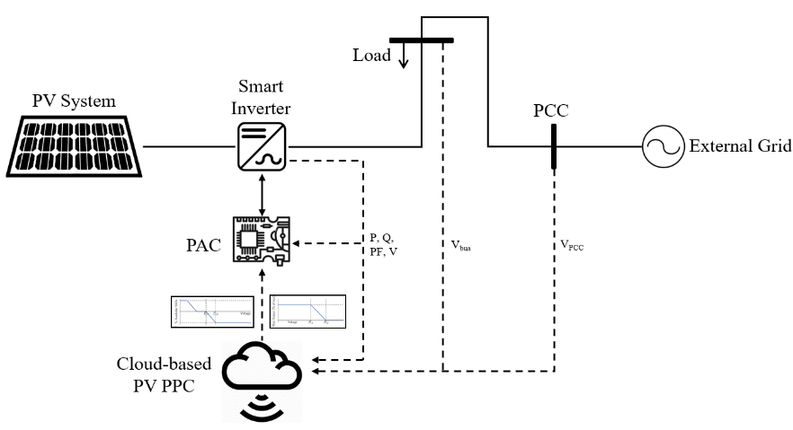

## Test Specification Definition

<table>
<tr>
<th colspan=1>
ID</th>
<td colspan=1>

3.01
</td>
</tr>
<tr>
<th colspan=1>
Reference to Test Case</th>
<td colspan=1>

TC3
</td>
</tr>
<tr>
<th colspan=1>
Title of Test</th>
<td colspan=1>

Cloud-based real-time supervision and voltage regulation ancillary services for PV systems
</td>
</tr>
<tr>
<th colspan=1>
Test Rationale</th>
<td colspan=1>

Design and demonstration of a grid-edge PV PPC that processes real-time signals from a cloud-based system for centralized supervision and localized voltage regulation at the PCC
</td>
</tr>
<tr>
<th colspan=1>
Specific Test System  
(graphical)</th>
<td colspan=1>

</td>
</tr>
<tr>
<th colspan=1>
Target measures</th>
<td colspan=1>
<ul>
<li>Observability of PV system and smart meter data</li>
<li>Voltage regulation at PCC</li>
<li>Centralized active power limitation of smart inverters </li>
<li>PV system active and reactive power control</li>
</ul></td>
</tr>
<tr>
<th colspan=1>
Input and output parameters</th>
<td colspan=1>

Input parameters:
<ul>
<li>Smart meter voltage at PCC</li>
<li>PV inverter Volt-Watt and Volt-VAR control characteristic curves</li>
</ul>
Output parameters:
<ul>
<li>Immediate smart inverter connection/disconnection signal</li>
<li>Smart meter voltage, frequency, apparent, active and reactive power</li>
<li>PV system active and reactive power</li>
</ul></td>
</tr>
<tr>
<th colspan=1>
Test Design</th>
<td colspan=1>
<ul>
<li>Variation of PV system generated power </li>
<li>Implementation of different control methods</li>
</ul></td>
</tr>
<tr>
<th colspan=1>
Initial system state</th>
<td colspan=1>
<ul>
<li>Voltage close to 1 pu</li>
<li>Unregulated PV system operating at maximum power point (MPP) mode</li>
</ul></td>
</tr>
<tr>
<th colspan=1>
Evolution of system state and test signals</th>
<td colspan=1>
<ul>
<li>Measurement of increase/decrease of voltage at PCC </li>
<li>Increase/decrease of active and reactive power with respect to voltage magnitude</li>
</ul></td>
</tr>
<tr>
<th colspan=1>
Other parameters</th>
<td colspan=1>

n/a
</td>
</tr>
<tr>
<th colspan=1>
Temporal resolution</th>
<td colspan=1>

1 second
</td>
</tr>
<tr>
<th colspan=1>
Source of uncertainty</th>
<td colspan=1>
<ul>
<li>Uncertainty of smart meter voltage measurements (0.5%)</li>
<li>Uncertainty of smart inverter power measurements (1%)</li>
</ul></td>
</tr>
<tr>
<th colspan=1>
Suspension criteria / Stopping criteria</th>
<td colspan=1>
<ul>
<li>Abnormal over or under voltage conditions</li>
</ul></td>
</tr>
</table>

