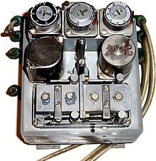

## Document History


<table>
<tr>
<th colspan=4>
Document History</th>
</tr>
<tr>
<th colspan=1>
Date</th>
<th colspan=1>
Version</th>
<th colspan=1>
Description</th>
<th colspan=1>
Author</th>
</tr>
<tr>
<td colspan=1>
<p>2023-04-03</p></td>
<td colspan=1>
<p>0.1</p></td>
<td colspan=1>
<p>first draft</p></td>
<td colspan=1>
<p>Edmund Widl (AIT)</p></td>
</tr>
<tr>
<td colspan=1>
<p>2024-01-25</p></td>
<td colspan=1>
<p>0.2</p></td>
<td colspan=1>
<p>Added identification</p></td>
<td colspan=1>
<p>Filip Pröstl Andrén (AIT)</p></td>
</tr>
</table>


## Control Function Identification


<table>
<tr>
<th colspan=2>
Control Function Identification</th>
</tr>
<tr>
<th colspan=1>
Control Function ID</th>
<th colspan=1>
Name</th>
</tr>
<tr>
<td colspan=1>
<p>MENB-CF-PID</p></td>
<td colspan=1>
<p>PID controller for the hydraulic pump</p></td>
</tr>
</table>


## Functional Description


<table>
<tr>
<th colspan=1>
Functional Description</th>
</tr>
<tr>
<td colspan=1>
<p>Background:</p><p>System configuration MENB-SC includes a heat pump. A hydraulic pump controls the mass flow in the heat pump’s condenser loop, where cold water is drawn from the bottom of a storage tank, heated up in the heat pump’s condenser and fed back at the top of the tank.</p><p>Problem formulation:</p><p>The operation of the heat pump is limited by a power consumption setpoint (coming from a voltage controller). The controller specified in this document regulates the mass flow rate through the heat pump’s condenser loop via the hydraulic pump such that this power consumption setpoint is met. </p></td>
</tr>
</table>


## Terminology


<table>
<tr>
<th colspan=2>
Terminology</th>
</tr>
<tr>
<td colspan=1>
<p>PID controller</p></td>
<td colspan=1>
<p>A proportional-integral-derivative (PID) controller is a control loop mechanism employing feedback that is widely used in applications requiring continuously modulated control. A PID controller continuously calculates an error value e(t) as the difference between a desired setpoint (SP) and a measured process variable (PV) and applies a correction based on proportional, integral, and derivative terms (denoted P, I, and D respectively).</p></td>
</tr>
</table>


## Methodology


<table>
<tr>
<th colspan=1>
Methodology</th>
</tr>
<tr>
<td colspan=1>
<p>This control function implements a .</p></td>
</tr>
</table>


## Limitations


<table>
<tr>
<th colspan=1>
Limitations</th>
</tr>
<tr>
<td colspan=1>
<p>N/A</p></td>
</tr>
</table>


## Inputs


### meas_hp_p_el


<table>
<tr>
<th colspan=2>
Control Function Input</th>
</tr>
<tr>
<th colspan=1>
Name</th>
<td colspan=1>
<p>meas_hp_p_el</p></td>
</tr>
<tr>
<th colspan=1>
Type (according to SC description)</th>
<td colspan=1>
<p>MeasureConnection</p></td>
</tr>
<tr>
<th colspan=1>
Unit</th>
<td colspan=1>
<p>kWel</p></td>
</tr>
<tr>
<th colspan=1>
Range</th>
<td colspan=1>
<p>[0, 100]</p></td>
</tr>
<tr>
<th colspan=1>
Expected update rate</th>
<td colspan=1>
<p>1 Hz</p></td>
</tr>
<tr>
<th colspan=1>
Description</th>
<td colspan=1>
<p>measurement of electrical power consumption of heat pump </p></td>
</tr>
</table>

### setpoint_hp_p_el


<table>
<tr>
<th colspan=2>
Control Function Input</th>
</tr>
<tr>
<th colspan=1>
Name</th>
<td colspan=1>
<p>setpoint_hp_p_el</p></td>
</tr>
<tr>
<th colspan=1>
Type (according to SC description)</th>
<td colspan=1>
<p>CtrlConnection</p></td>
</tr>
<tr>
<th colspan=1>
Unit</th>
<td colspan=1>
<p>MWel</p></td>
</tr>
<tr>
<th colspan=1>
Range</th>
<td colspan=1>
<p>[0, 0.15]</p></td>
</tr>
<tr>
<th colspan=1>
Expected update rate</th>
<td colspan=1>
<p>every 5 min</p></td>
</tr>
<tr>
<th colspan=1>
Description</th>
<td colspan=1>
<p>setpoint for power consumption of heat pump from voltage controller</p></td>
</tr>
</table>


## Outputs


### setpoint_cond_mflow


<table>
<tr>
<th colspan=2>
Control Function Output</th>
</tr>
<tr>
<th colspan=1>
Name</th>
<td colspan=1>
<p>setpoint_cond_mflow</p></td>
</tr>
<tr>
<th colspan=1>
Type (according to SC description)</th>
<td colspan=1>
<p>CtrlConnection</p></td>
</tr>
<tr>
<th colspan=1>
Unit</th>
<td colspan=1>
<p>kg/s</p></td>
</tr>
<tr>
<th colspan=1>
Range</th>
<td colspan=1>
<p>[0, 10]</p></td>
</tr>
<tr>
<th colspan=1>
Expected update rate</th>
<td colspan=1>
<p>1 Hz</p></td>
</tr>
<tr>
<th colspan=1>
Description</th>
<td colspan=1>
<p>setpoint for heat pump condenser mass flow</p></td>
</tr>
</table>


## Use Cases


### Heat pump operation


<table>
<tr>
<th colspan=1>
Use Case Example</th>
<th colspan=1>
Heat pump operation</th>
</tr>
<tr>
<th colspan=1>
Date created</th>
<td colspan=1>
<p>2023-04-03</p></td>
</tr>
<tr>
<th colspan=1>
Actor</th>
<td colspan=1>
<ul>
<li>PID controller</li>
<li>hydraulic pump</li>
<li>heat pump</li>
</ul></td>
</tr>
<tr>
<th colspan=1>
Description</th>
<td colspan=1>
<p>The mass flow through the heat pump’s condenser loop is determined by the operation of the hydraulic pump. With the help of a PID controller (see Figure 1) the mass flow of the hydraulic pump is regulated.</p></td>
</tr>
<tr>
<th colspan=1>
Preconditions</th>
<td colspan=1>
<p>The power consumption setpoint for the heat pump is not zero.</p></td>
</tr>
<tr>
<th colspan=1>
Postconditions</th>
<td colspan=1>
<p>N/A</p></td>
</tr>
<tr>
<th colspan=1>
Priority</th>
<td colspan=1>
<p>medium</p></td>
</tr>
<tr>
<th colspan=1>
Frequency of use</th>
<td colspan=1>
<p>1 Hz</p></td>
</tr>
<tr>
<th colspan=1>
Normal course</th>
<td colspan=1>
<p>The mass flow through the hydraulic pump is regulated using the heat pump’s power consumption as process variable and a setpoint (see Figure 1).</p><p>PID controller parameters:</p><ul>
<li>Kp = 1e-4</li>
<li>Ti = 10 s</li>
<li>Td = 10 s</li>
</ul></td>
</tr>
<tr>
<th colspan=1>
Alternative course</th>
<td colspan=1>
<p>In case the power consumption setpoint of the heat pump is set to zero, the hydraulic pump is switched off. The PID output is then set to zero, resulting in zero mass flow rate.</p></td>
</tr>
<tr>
<th colspan=1>
Exceptions</th>
<td colspan=1>
<p>N/A</p></td>
</tr>
<tr>
<th colspan=1>
Assumptions</th>
<td colspan=1>
<p>N/A</p></td>
</tr>
<tr>
<th colspan=1>
Notes and issues</th>
<td colspan=1>
<p>N/A</p></td>
</tr>
</table>


## Diagrams


<table>
<tr>
<th colspan=1>
Diagrams</th>
</tr>
<tr>
<th colspan=1>
Schematic view of the control setup</th>
</tr>
<tr>
<td colspan=1>
<p></p><p>Figure : PID control setup for regulating the heat pump’s power consumption.</p></td>
</tr>
</table>


## Algorithms


<table>
<tr>
<th colspan=1>
Algorithms</th>
</tr>
<tr>
<th colspan=1>
Controller algorithm</th>
</tr>
<tr>
<td colspan=1>

```
N/A
```

</td>
</tr>
</table>


## Deterministic Functions


<table>
<tr>
<th colspan=1>
Deterministic Functions</th>
</tr>
<tr>
<td colspan=1>
<p>Error value:</p><p><math><mi>e</mi><mrow><mo>(</mo><mi>t</mi><mo>)</mo></mrow><mo>=</mo><mtext>meas_hp_p_el</mtext><mrow><mo>(</mo><mi>t</mi><mo>)</mo></mrow><mo>-</mo><mtext>setpoint_hp_p_el</mtext><mrow><mo>(</mo><mi>t</mi><mo>)</mo></mrow></math></p><p>Control variable:</p><p><math><mtext>setpoint_cond_mflow</mtext><mtext> </mtext><mrow><mo>(</mo><mi>t</mi><mo>)</mo></mrow><mo>=</mo><msub><mrow><mi>K</mi></mrow><mrow><mtext>p</mtext></mrow></msub><mrow><mo>[</mo><mi>e</mi><mrow><mo>(</mo><mi>t</mi><mo>)</mo></mrow><mo>+</mo><mn>1</mn><mo>/</mo><msub><mrow><mi>T</mi></mrow><mrow><mtext>i</mtext></mrow></msub><mrow><msubsup><mo stretchy="false">∫</mo><mrow><mn>0</mn></mrow><mrow><mi>t</mi></mrow></msubsup><mrow><mi>e</mi><mrow><mo>(</mo><mi>τ</mi><mo>)</mo></mrow><mtext>d</mtext><mi>τ</mi><mi> </mi><mi> </mi><mi> </mi></mrow></mrow><mo>+</mo><msub><mrow><mi>T</mi></mrow><mrow><mtext>d</mtext></mrow></msub><mfrac><mrow><mtext>d</mtext><mi>e</mi><mrow><mo>(</mo><mi>t</mi><mo>)</mo></mrow></mrow><mrow><mtext>d</mtext><mi>t</mi></mrow></mfrac><mo>]</mo></mrow></math></p></td>
</tr>
</table>


## Stochastic Functions


<table>
<tr>
<th colspan=1>
Stochastic Functions</th>
</tr>
<tr>
<td colspan=1>
<p>N/A</p></td>
</tr>
</table>


## Deployment


<table>
<tr>
<th colspan=1>
Deployment</th>
</tr>
<tr>
<td colspan=1>
<p>A state-of-the-art pneumatic PID controller device is used for the deployment (see Figure 2).</p><p></p><p>Figure : PID controller device (source: Wikipedia)</p></td>
</tr>
</table>


## References


<table>
<tr>
<th colspan=1>
References</th>
</tr>
<tr>
<td colspan=1>
<p>N/A</p></td>
</tr>
</table>


