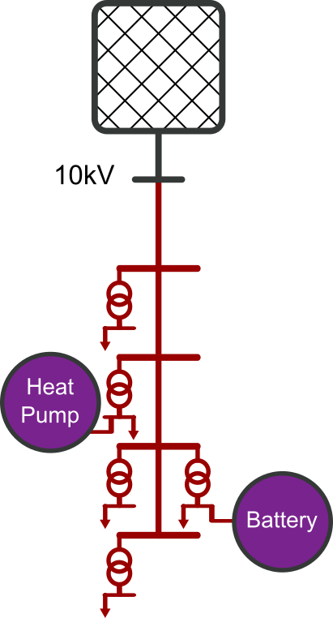
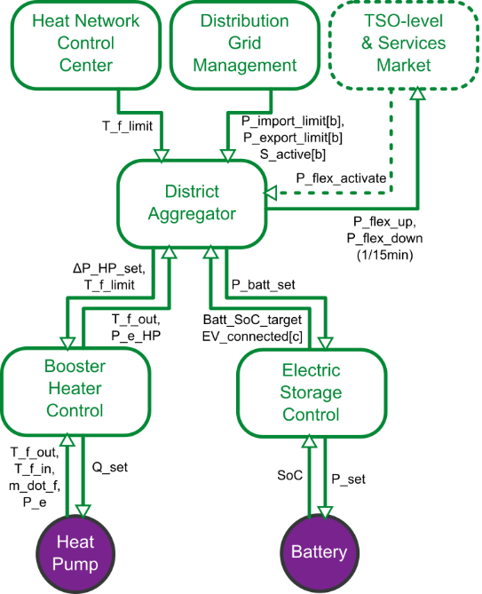

## Test Specification Definition

<table>
<tr>
<th colspan=1>
ID</th>
<td colspan=1>

TC08.TS01
</td>
</tr>
<tr>
<th colspan=1>
Reference to Test Case</th>
<td colspan=1>

TC08
</td>
</tr>
<tr>
<th colspan=1>
Title of Test</th>
<td colspan=1>

Local controller responds to service requests from aggregator controller
</td>
</tr>
<tr>
<th colspan=1>
Test Rationale</th>
<td colspan=1>

This test characterizes district operation of a simple long district heat pipe with heat booster HP and without Booster Heater Controller and Electric Storage Controller active, seeking to demonstrate that the local controllers respond to service requests from the aggregator controller.
</td>
</tr>
<tr>
<th colspan=1>
Specific Test System  
(graphical)</th>
<td colspan=1>

The system under test includes an electrical system, a district heating system and a control system. Each is sketched below.

Thermal system

The thermal system is a simplified distribution network which includes a booster heat pump. The heat load is aggregated in two locations.

Electrical system

The electrical system corresponds to a single feeder.

Control domain coupling

The distribution grid management does not form part of the system under test but are taken as exogenous signals.
</td>
</tr>
<tr>
<th colspan=1>
Target measures</th>
<td colspan=1>

See Test Design.
</td>
</tr>
<tr>
<th colspan=1>
Input and output parameters</th>
<td colspan=1>
<ul>
<li>P_PCC: Measured apparent electrical import at the district electrical network point of common coupling [kWe]</li>
<li>Q_PCC: Measured heat import at the district heating network point of common coupling [kWq]</li>
<li>P_booster: Measured electrical active power consumption of district booster heater [kWe]</li>
</ul></td>
</tr>
<tr>
<th colspan=1>
Test Design</th>
<td colspan=1>

The test comprises 24 hours of district operation. During these 24 hours, the heat pump controller is asked to keep the forward temperature of the connected pipe above 70ºC.

Further, these services are requested of the Aggregator by the Distribution Grid Management:
<ul>
<li>for 07:00 to 09:00, keep district electrical consumption below P_import_limit kW..</li>
<li>for 11:00 to 14:00, keep district electrical consumption above P_export_limit kW.</li>
<li>for 17:00 to 19:00, keep district electrical consumption below P_import_limit kW</li>
</ul>
where these limits are defined as below.

The test consists of several runs:
<ol>
<li>no service signal sent</li>
<li>service signals sent (gamma indicates the level of service requested – lower gamma = more service requested)</li>
<li>gamma = 1.0</li>
<li>gamma = 0.95</li>
<li>gamma = 0.90</li>
<li>gamma = 0.85</li>
<li>gamma = 0.80</li>
</ol>
By comparing these runs, whether the controllers respond to service requests can be established.

For run 1, set:
<ul>
<li>P_import_limit = inf,</li>
<li>P_export_limit = -inf</li>
<li>gamma=1.0.</li>
</ul>
For subsequent runs (given the 99% quantile of district electrical import P_i_99 and the 1% quantile of district electrical import, P_i_1), the system is asked to restrict its import relative to the uncontrolled base case:
<ul>
<li>P_export_limit= gamma * P_i_1 kWe</li>
<li>P_import_limit = gamma* P_i_99 kWe,</li>
</ul></td>
</tr>
<tr>
<th colspan=1>
Initial system state</th>
<td colspan=1>
<ul>
<li>each component is initialized to the state given in the associated dataset</li>
<li>the battery state of charge is set to 50% of nomimal energy</li>
<li>the district heating system is allowed to relax to a steady state with the heat pump turned off</li>
</ul></td>
</tr>
<tr>
<th colspan=1>
Evolution of system state and test signals</th>
<td colspan=1>

Test signals:
<ul>
<li>P_import_limit: District electrical consumption bound requested from battery/EV units [kWe]</li>
<li>P_export_limit: District electrical export bound requested from heating units [kWe]</li>
<li>gamma: Scaling factor for district import and export [n.u.]</li>
</ul></td>
</tr>
<tr>
<th colspan=1>
Other parameters</th>
<td colspan=1>

N/A
</td>
</tr>
<tr>
<th colspan=1>
Temporal resolution</th>
<td colspan=1>

The test is run at a fixed time step of 10 seconds.
</td>
</tr>
<tr>
<th colspan=1>
Source of uncertainty</th>
<td colspan=1>

Since the exact electrical demand signal consists of a deterministic trend and a randomized factor, each “run” above should be repeated 10 times, with the mean and standard deviation of each target metric recorded.
</td>
</tr>
<tr>
<th colspan=1>
Suspension criteria / Stopping criteria</th>
<td colspan=1>

N/A
</td>
</tr>
</table>

