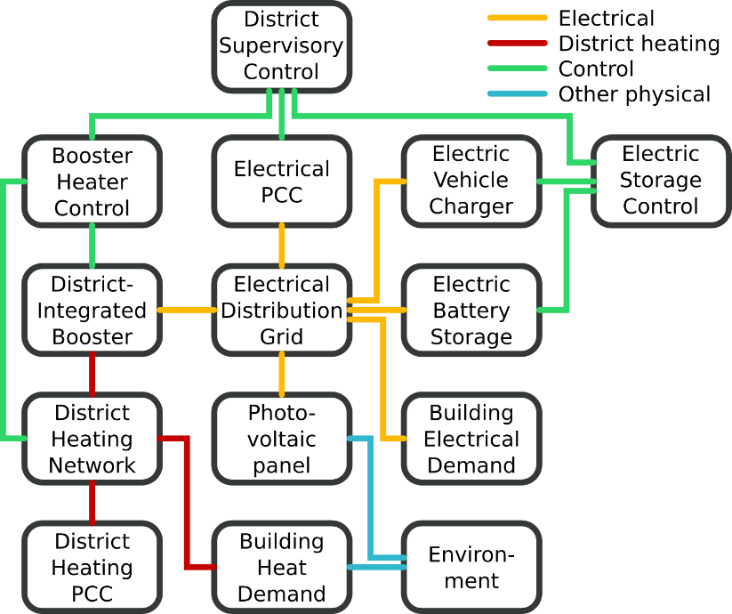

## Identification

<table>
<tr>
<th colspan=1>
ID</th>
<td colspan=1>

TC08
</td>
</tr>
<tr>
<th colspan=1>
Author</th>
<td colspan=1>

Tue Jensen, Kai Heussen, Edmund Widl
</td>
</tr>
<tr>
<th colspan=1>
Version</th>
<td colspan=1>

1.0
</td>
</tr>
<tr>
<th colspan=1>
Project</th>
<td colspan=1>

SmILES, ERIGrid 2.0
</td>
</tr>
<tr>
<th colspan=1>
Date</th>
<td colspan=1>

2020-12-16
</td>
</tr>
</table>

## Test Case Definition

<table>
<tr>
<th colspan=2>
Name of the Test Case</th>
<td colspan=1>

Characterization of power-to-heat service availability and its impact on the networks
</td>
</tr>
<tr>
<th colspan=2>
Narrative</th>
<td colspan=1>

A heating network-integrated booster heat pump is used to also provide ancillary services to the electrical system. In the local electrical distribution network congestion may appear, and other flexibility options are available. 

This test seeks to characterize the impact of the use of local flexibility (to relieve congestion) on the available regulating power ancillary service from a local district. The test targets a quantification of the ability of the integrated system to provide flexibility services under conflict situations. 
</td>
</tr>
<tr>
<th colspan=2>
Function(s) under Investigation (FuI)</th>
<td colspan=1>

The heating system provides services to the electrical system (a) congestion management - electrical import and export limitation; and (b) ancillary service/“regulating power” provision. 
</td>
</tr>
<tr>
<th colspan=2>
Object under Investigation (OuI)</th>
<td colspan=1>

The characterization concerns the Booster Heater Controller and the Electric Storage Controller in combination with the District Supervisory Controller.
</td>
</tr>
<tr>
<th colspan=2>
Domain under Investigation (DuI)</th>
<td colspan=1>
<ul>
<li>power (low voltage distribution network)</li>
<li>heat (coupling points to thermal network)</li>
<li>control (storage and heat network control)</li>
</ul></td>
</tr>
<tr>
<th colspan=2>
Purpose of Investigation (PoI)</th>
<td colspan=1>

Characterize the impact use of local flexibility on available ancillary service capacity from a local district.
</td>
</tr>
<tr>
<th colspan=2>
System under Test (SuT)</th>
<td colspan=1>

“PCC” denotes the point of common coupling for the district to the external networks. All units connected downstream of the respective PCCs must be considered.
</td>
</tr>
<tr>
<th colspan=2>
Functions under Test (FuT)</th>
<td colspan=1>
<ul>
<li>electrical and heat exchange (at respective PCC)</li>
<li>electrical energy bound violation</li>
<li>total district electricity export</li>
<li>total district thermal energy import</li>
</ul></td>
</tr>
<tr>
<th colspan=3>
</th>
</tr>
<tr>
<th colspan=2>
Test criteria</th>
<td colspan=1>

The TCR (test criteria) aim to quantify the resource and service conflicts: 

1) the export/import from the electrical distribution network (including the respect for capacity limitations); 

2) the service level at the district heating network (energy and service level violations)
</td>
</tr>
<tr>
<td colspan=1>
</td>
<th colspan=1>
target metrics</th>
<td colspan=1>
<ul>
<li>electrical energy bound violation in MWh: given a limit  for , measure the violation via the total electrical energy consumption as</li>
<li>,</li>
</ul>
where  is a one-sided error measure, e.g. (x)=x if x&gt;0, else x=0.
<ul>
<li>electrical and heat exchange (at respective PCC) in MWh</li>
<li>total district electricity export in MWh</li>
<li>total district thermal energy import in MWh</li>
</ul></td>
</tr>
<tr>
<td colspan=1>
</td>
<th colspan=1>
variability attributes</th>
<td colspan=1>

Controllable factors:
<ul>
<li>booster heater activation</li>
<li>electrical storage system activation</li>
</ul>
Uncontrollable factors:
<ul>
<li>demand (electrical and thermal)</li>
<li>PV generation</li>
<li>prices</li>
</ul></td>
</tr>
<tr>
<td colspan=1>
</td>
<th colspan=1>
quality attributes</th>
<td colspan=1>

N/A
</td>
</tr>
</table>

## Qualification Strategy

The PoI is addressed first using a simple implementation to verify the test concept and the functional principles, the outcome of TS01 is a preliminary characterisation of the same TCR as TS02. TS02 will then refine and validate the characterisation on a more realistic study case. 

