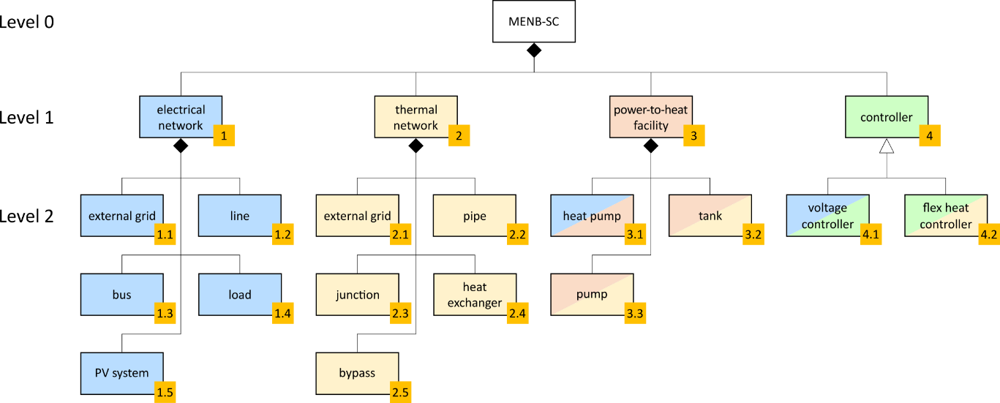
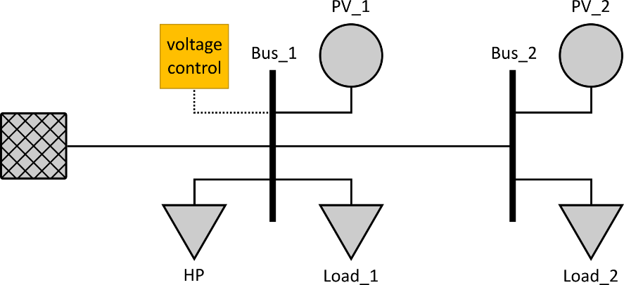
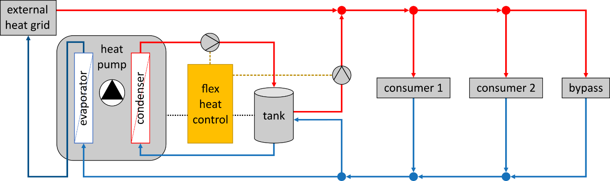

## Document History

<table>
<tr>
<th colspan=4>
Document History</th>
</tr>
<tr>
<th colspan=1>
Date</th>
<th colspan=1>
Version</th>
<th colspan=1>
Description</th>
<th colspan=1>
Author</th>
</tr>
<tr>
<td colspan=1>

2021-03-23
</td>
<td colspan=1>

0.1
</td>
<td colspan=1>

First draft version
</td>
<td colspan=1>

Edmund Widl (AIT)
</td>
</tr>
<tr>
<td colspan=1>

2021-05-17
</td>
<td colspan=1>

0.2
</td>
<td colspan=1>

Add quasi-static thermal network system configuration
</td>
<td colspan=1>

Christopher Wild (DTU)
</td>
</tr>
<tr>
<td colspan=1>

2021-09-01
</td>
<td colspan=1>

0.3
</td>
<td colspan=1>

Add additional information for the electric network configuration
</td>
<td colspan=1>

Tran The Hoang (CEA)
</td>
</tr>
<tr>
<td colspan=1>

2021-11-19
</td>
<td colspan=1>

1.0
</td>
<td colspan=1>

Update system configuration to the final implemented benchmark setup
</td>
<td colspan=1>

Edmund Widl (AIT)
</td>
</tr>
<tr>
<td colspan=1>

2022-11-11
</td>
<td colspan=1>

1.1
</td>
<td colspan=1>

Adapt to ERIGrid 2.0 SC template:
<ul>
<li>focus on testing / simulation</li>
<li>make template parseable</li>
<li>improved SBD</li>
</ul></td>
<td colspan=1>

Edmund Widl (AIT)
</td>
</tr>
</table>

## System Configuration Identification

<table>
<tr>
<th colspan=2>
System Configuration Identification</th>
</tr>
<tr>
<th colspan=1>
System configuration ID [ID]</th>
<th colspan=1>
Name</th>
</tr>
<tr>
<td colspan=1>

MENB-SC
</td>
<td colspan=1>

System configuration for the multi-energy network benchmark 
</td>
</tr>
</table>

## Short Description of Context

<table>
<tr>
<th colspan=1>
Short Description of Context</th>
</tr>
<tr>
<th colspan=1>
Context description</th>
</tr>
<tr>
<td colspan=1>

The system configuration described in this document has been developed as part of a reference setup for multi-domain energy network simulations. This reference setup intends to inspire the use of co-simulation for the assessment of multi-energy systems.

The level of detail was chosen in a way that allows to apply different modelling approaches for the individual subsystems. For instance, the thermal network could be implemented either in a quasi-static model (series of equilibrium states) or a dynamic model (hydraulic transients).

The system configuration resembles part of the sub-urban area of a typical Central European city. The climate is typical for Central Europe with its moderately warm summers and cold winters. Solar irradiation ranges between 800 and 1200 kWh/m². Ambient ground temperature is constant at 8°C.
</td>
</tr>
<tr>
<th colspan=1>
Key figures</th>
</tr>
<tr>
<td colspan=1>
<ul>
<li>electrical network: 2 consecutive lines (0.3 km each), connected to external grid</li>
<li>thermal network: 3 main consecutive pipes (supply and return, 0.5 km each), connected to external grid</li>
<li>power-to-heat facility: 1 heat pump (max. 100 kWel) connected to a thermal tank (100 m3) feeding into the thermal network</li>
<li>consumption: 2 consumers, each representing the aggregated loads (electrical and thermal) of an urban quarter and connected to both networks</li>
<li>generation: 2 PV systems (one of 150 kWel, peak and one of 50 kWel, peak)</li>
</ul></td>
</tr>
<tr>
<th colspan=1>
Keywords</th>
</tr>
<tr>
<td colspan=1>
<ul>
<li>local consumption of high PV generation</li>
<li>decentralized heat generation</li>
<li>heat pumps</li>
<li>coupled heat and electric networks</li>
</ul></td>
</tr>
<tr>
<th colspan=1>
Ontology / namespace (optional)</th>
</tr>
<tr>
<td colspan=1>

N/A
</td>
</tr>
</table>

## System Breakdown Diagram

<table>
<tr>
<th colspan=1>
System Breakdown Diagram</th>
</tr>
<tr>
<td colspan=1>

</td>
</tr>
</table>

## Graphical Representation of System Configuration

<table>
<tr>
<th colspan=1>
Graphical Representation of System Configuration</th>
</tr>
<tr>
<th colspan=1>
Overview</th>
</tr>
<tr>
<td colspan=1>

</td>
</tr>
<tr>
<th colspan=1>
Electrical Grid (detailed view)</th>
</tr>
<tr>
<td colspan=1>

</td>
</tr>
<tr>
<th colspan=1>
Thermal grid (detailed view):</th>
</tr>
<tr>
<td colspan=1>

</td>
</tr>
</table>

## Terminal Description

<table>
<tr>
<th colspan=5>
Terminal Description</th>
</tr>
<tr>
<th colspan=1>
Name</th>
<th colspan=1>
Type ID</th>
<th colspan=1>
Type of exchange</th>
<th colspan=1>
Connected component classes</th>
<th colspan=1>
Comment</th>
</tr>
<tr>
<td colspan=1>

Heat connector
</td>
<td colspan=1>

Heat-Connection
</td>
<td colspan=1>

heat flow 
(water mass flow)
</td>
<td colspan=1>

ExternalElectricGrid, Line, Busbar, Load, PVSystem, HeatPump
</td>
<td colspan=1>

connects components of the thermal network
</td>
</tr>
<tr>
<td colspan=1>

Electric power connector
</td>
<td colspan=1>

Electric-Connection
</td>
<td colspan=1>

electric power flow (electric current)
</td>
<td colspan=1>

ExternalThermalGrid, Pipe, Junction, Bypass, HeatExchanger, Tank, HeatPump, Pump
</td>
<td colspan=1>

connects components of the electrical network
</td>
</tr>
<tr>
<td colspan=1>

Measurement connector
</td>
<td colspan=1>

Measure-Connection
</td>
<td colspan=1>

measurement exchange (communicationsignal) 
</td>
<td colspan=1>

Bus, Tank, HeatPump, VoltageController, FlexHeatController
</td>
<td colspan=1>

connects sensors with controllers via a communication link
</td>
</tr>
<tr>
<td colspan=1>

Control connector
</td>
<td colspan=1>

Ctrl-Connection
</td>
<td colspan=1>

control signal exchange (communicationsignal)
</td>
<td colspan=1>

Pump, HeatPump, VoltageController, FlexHeatController
</td>
<td colspan=1>

connects controllers with actuators via a communication link
</td>
</tr>
</table>

## Component descriptions

### ElectricNetwork

<table>
<tr>
<th colspan=3>
Component description</th>
</tr>
<tr>
<th colspan=1>
Tag in SBD</th>
<td colspan=2>

1
</td>
</tr>
<tr>
<th colspan=1>
Level in SBD</th>
<td colspan=2>

1
</td>
</tr>
<tr>
<th colspan=1>
Class ID</th>
<td colspan=2>

ElectricNetwork
</td>
</tr>
<tr>
<th colspan=1>
Parent class</th>
<td colspan=2>

-
</td>
</tr>
<tr>
<th colspan=1>
Contained in</th>
<td colspan=2>

MENB-SC
</td>
</tr>
<tr>
<th colspan=1>
Description</th>
<td colspan=2>

This element represents an electric distribution network. It contains interconnected components with the purpose of delivering electricity to the consumers.
</td>
</tr>
<tr>
<th colspan=1>
Number of components in SC</th>
<td colspan=2>

1
</td>
</tr>
<tr>
<th colspan=3>
Attributes</th>
</tr>
<tr>
<th colspan=1>
Functionality</th>
<td colspan=2>

The electrical network’s actual functionality is determined by its components. This class serves as logical unit containing these components and has itself no functionality.
</td>
</tr>
<tr>
<th colspan=1>
Physical characteristics</th>
<td colspan=2>

-
</td>
</tr>
<tr>
<th colspan=3>
Terminals</th>
</tr>
<tr>
<th colspan=1>
Terminal ID</th>
<th colspan=1>
Type ID</th>
<th colspan=1>
Description</th>
</tr>
<tr>
<td colspan=1>

-
</td>
<td colspan=1>

-
</td>
<td colspan=1>

-
</td>
</tr>
<tr>
<th colspan=3>
Instances</th>
</tr>
<tr>
<th colspan=1>
Instance ID</th>
<th colspan=2>
Instance parameterization</th>
</tr>
<tr>
<td colspan=1>

el_net
</td>
<td colspan=2>

-
</td>
</tr>
</table>

### ExternalElectricGrid

<table>
<tr>
<th colspan=3>
Component description</th>
</tr>
<tr>
<th colspan=1>
Tag in SBD</th>
<td colspan=2>

1.1
</td>
</tr>
<tr>
<th colspan=1>
Level in SBD</th>
<td colspan=2>

2
</td>
</tr>
<tr>
<th colspan=1>
Class ID</th>
<td colspan=2>

ExternalElectricGrid
</td>
</tr>
<tr>
<th colspan=1>
Parent class</th>
<td colspan=2>

-
</td>
</tr>
<tr>
<th colspan=1>
Contained in</th>
<td colspan=2>

el_net
</td>
</tr>
<tr>
<th colspan=1>
Description</th>
<td colspan=2>

This element represents a connection to an external electrical grid supplying the local electrical distribution network.
</td>
</tr>
<tr>
<th colspan=1>
Number of components in SC</th>
<td colspan=2>

1
</td>
</tr>
<tr>
<th colspan=3>
Attributes</th>
</tr>
<tr>
<th colspan=1>
Functionality</th>
<td colspan=2>

The external grid controls the voltage and the phase angle of the busbar to which it is connected.
</td>
</tr>
<tr>
<th colspan=1>
Physical characteristics</th>
<td colspan=2>
<ul>
<li>f (float) - Nominal frequency [Hz]</li>
<li>vn (float) - Nominal voltage [kV]</li>
</ul></td>
</tr>
<tr>
<th colspan=3>
Terminals</th>
</tr>
<tr>
<th colspan=1>
Terminal ID</th>
<th colspan=1>
Type ID</th>
<th colspan=1>
Description</th>
</tr>
<tr>
<td colspan=1>

plug_ext
</td>
<td colspan=1>

ElectricConnection
</td>
<td colspan=1>

connection point of the electrical distribution network to the external grid
</td>
</tr>
<tr>
<th colspan=3>
Instances</th>
</tr>
<tr>
<th colspan=1>
Instance ID</th>
<th colspan=2>
Instance parameterization</th>
</tr>
<tr>
<td colspan=1>

ext_el_grid
</td>
<td colspan=2>
<ul>
<li>f [Hz]: 220</li>
<li>vn [kV]: 0.4</li>
</ul></td>
</tr>
</table>

### Line

<table>
<tr>
<th colspan=3>
Component description</th>
</tr>
<tr>
<th colspan=1>
Tag in SBD</th>
<td colspan=2>

1.2
</td>
</tr>
<tr>
<th colspan=1>
Level in SBD</th>
<td colspan=2>

2
</td>
</tr>
<tr>
<th colspan=1>
Class ID</th>
<td colspan=2>

Line
</td>
</tr>
<tr>
<th colspan=1>
Parent class</th>
<td colspan=2>

-
</td>
</tr>
<tr>
<th colspan=1>
Contained in</th>
<td colspan=2>

el_net
</td>
</tr>
<tr>
<th colspan=1>
Description</th>
<td colspan=2>

This element represents a power line of an electrical distribution network.
</td>
</tr>
<tr>
<th colspan=1>
Number of components in SC</th>
<td colspan=2>

2
</td>
</tr>
<tr>
<th colspan=3>
Attributes</th>
</tr>
<tr>
<th colspan=1>
Functionality</th>
<td colspan=2>

The power lines transport electricity between the busbars of an electrical network.
</td>
</tr>
<tr>
<th colspan=1>
Physical characteristics</th>
<td colspan=2>
<ul>
<li>l (float): line length [km]</li>
<li>r (float): resistance [Ω/km] </li>
<li>x (float): reactance [Ω/km]</li>
<li>c (float): capacitance [nF/km]</li>
<li>max_i (float): rated current [kA]</li>
</ul></td>
</tr>
<tr>
<th colspan=3>
Terminals</th>
</tr>
<tr>
<th colspan=1>
Terminal ID</th>
<th colspan=1>
Type ID</th>
<th colspan=1>
Description</th>
</tr>
<tr>
<td colspan=1>

plug_line_a
</td>
<td colspan=1>

ElectricConnection
</td>
<td colspan=1>

connection to a bus of the electrical distribution network on one side of the power line
</td>
</tr>
<tr>
<td colspan=1>

plug_line_b
</td>
<td colspan=1>

ElectricConnection
</td>
<td colspan=1>

connection to a bus of the electrical distribution network on other side of the power line
</td>
</tr>
<tr>
<th colspan=3>
Instances</th>
</tr>
<tr>
<th colspan=1>
Instance ID</th>
<th colspan=2>
Instance parameterization</th>
</tr>
<tr>
<td colspan=1>

line_1
</td>
<td colspan=2>
<ul>
<li>l [km]: 0.3</li>
<li>r [Ω/km]: 0.306</li>
<li>x [Ω/km]: 0.29</li>
<li>c [nF/km]: 13.2</li>
<li>max_i [kA]: 0.35</li>
</ul></td>
</tr>
<tr>
<td colspan=1>

line_2
</td>
<td colspan=2>
<ul>
<li>l [km]: 0.3</li>
<li>r [Ω/km]: 0.306</li>
<li>x [Ω/km]: 0.29</li>
<li>c [nF/km]: 13.2</li>
<li>max_i [kA]: 0.35</li>
</ul></td>
</tr>
</table>

### Busbar

<table>
<tr>
<th colspan=3>
Component description</th>
</tr>
<tr>
<th colspan=1>
Tag in SBD</th>
<td colspan=2>

1.3
</td>
</tr>
<tr>
<th colspan=1>
Level in SBD</th>
<td colspan=2>

2
</td>
</tr>
<tr>
<th colspan=1>
Class ID</th>
<td colspan=2>

Busbar
</td>
</tr>
<tr>
<th colspan=1>
Parent class</th>
<td colspan=2>

-
</td>
</tr>
<tr>
<th colspan=1>
Contained in</th>
<td colspan=2>

el_net
</td>
</tr>
<tr>
<th colspan=1>
Description</th>
<td colspan=2>

This element represents an electrical busbar used in substations for local power distribution.
</td>
</tr>
<tr>
<th colspan=1>
Number of components in SC</th>
<td colspan=2>

2
</td>
</tr>
<tr>
<th colspan=3>
Attributes</th>
</tr>
<tr>
<th colspan=1>
Functionality</th>
<td colspan=2>

The electrical busbars connect the components of the electrical network (lines, loads, PV systems).
</td>
</tr>
<tr>
<th colspan=1>
Physical characteristics</th>
<td colspan=2>
<ul>
<li>vn (float) - nominal voltage [kV]</li>
</ul></td>
</tr>
<tr>
<th colspan=3>
Terminals</th>
</tr>
<tr>
<th colspan=1>
Terminal ID</th>
<th colspan=1>
Type ID</th>
<th colspan=1>
Description</th>
</tr>
<tr>
<td colspan=1>

plug_bus
</td>
<td colspan=1>

ElectricConnection
</td>
<td colspan=1>

connection point to other components (lines, loads, PV systems) of the electrical distribution network
</td>
</tr>
<tr>
<td colspan=1>

meas_voltage_pu
</td>
<td colspan=1>

MeasureConnection
</td>
<td colspan=1>

voltage measurement (for the voltage controller) [p.u.]
</td>
</tr>
<tr>
<th colspan=3>
Instances</th>
</tr>
<tr>
<th colspan=1>
Instance ID</th>
<th colspan=2>
Instance parameterization</th>
</tr>
<tr>
<td colspan=1>

bus_1
</td>
<td colspan=2>
<ul>
<li>vn [kV]: 0.4</li>
</ul></td>
</tr>
<tr>
<td colspan=1>

bus_2
</td>
<td colspan=2>
<ul>
<li>vn [kV]: 0.4</li>
</ul></td>
</tr>
</table>

### Load

<table>
<tr>
<th colspan=3>
Component description</th>
</tr>
<tr>
<th colspan=1>
Tag in SBD</th>
<td colspan=2>

1.4
</td>
</tr>
<tr>
<th colspan=1>
Level in SBD</th>
<td colspan=2>

2
</td>
</tr>
<tr>
<th colspan=1>
Class ID</th>
<td colspan=2>

Load
</td>
</tr>
<tr>
<th colspan=1>
Parent class</th>
<td colspan=2>

-
</td>
</tr>
<tr>
<th colspan=1>
Contained in</th>
<td colspan=2>

el_net
</td>
</tr>
<tr>
<th colspan=1>
Description</th>
<td colspan=2>

This element represents a component of the electrical network that consumes (active) electric power.
</td>
</tr>
<tr>
<th colspan=1>
Number of components in SC</th>
<td colspan=2>

3
</td>
</tr>
<tr>
<th colspan=3>
Attributes</th>
</tr>
<tr>
<th colspan=1>
Functionality</th>
<td colspan=2>

Each load represents an aggregation of the (active) power consumption of several consumers (e.g., households connected to an LV feeder).
</td>
</tr>
<tr>
<th colspan=1>
Physical characteristics</th>
<td colspan=2>
<ul>
<li>vn (float): nominal voltage [kV]</li>
<li>p (float): nominal active power consumption [kW]</li>
</ul></td>
</tr>
<tr>
<th colspan=3>
Terminals</th>
</tr>
<tr>
<th colspan=1>
Terminal ID</th>
<th colspan=1>
Type ID</th>
<th colspan=1>
Description</th>
</tr>
<tr>
<td colspan=1>

plug_load
</td>
<td colspan=1>

ElectricConnection
</td>
<td colspan=1>

connection to a bus of the electrical distribution network through which power is consumed
</td>
</tr>
<tr>
<th colspan=3>
Instances</th>
</tr>
<tr>
<th colspan=1>
Instance ID</th>
<th colspan=2>
Instance parameterization</th>
</tr>
<tr>
<td colspan=1>

load_1
</td>
<td colspan=2>
<ul>
<li>vn [kV]: 0.4</li>
<li>p [kW]: 120</li>
</ul></td>
</tr>
<tr>
<td colspan=1>

load_2
</td>
<td colspan=2>
<ul>
<li>vn [kV]: 0.4 </li>
<li>p [kW]: 45</li>
</ul></td>
</tr>
</table>

### PVSystem

<table>
<tr>
<th colspan=3>
Component description</th>
</tr>
<tr>
<th colspan=1>
Tag in SBD</th>
<td colspan=2>

1.5
</td>
</tr>
<tr>
<th colspan=1>
Level in SBD</th>
<td colspan=2>

2
</td>
</tr>
<tr>
<th colspan=1>
Class ID</th>
<td colspan=2>

PVSystem
</td>
</tr>
<tr>
<th colspan=1>
Parent class</th>
<td colspan=2>

-
</td>
</tr>
<tr>
<th colspan=1>
Contained in</th>
<td colspan=2>

el_net
</td>
</tr>
<tr>
<th colspan=1>
Description</th>
<td colspan=2>

This element represents a PV system comprising several PV panels.
</td>
</tr>
<tr>
<th colspan=1>
Number of components in SC</th>
<td colspan=2>

2
</td>
</tr>
<tr>
<th colspan=3>
Attributes</th>
</tr>
<tr>
<th colspan=1>
Functionality</th>
<td colspan=2>

The PV systems generates electrical power and supplies it to the electrical distribution network via a busbar connection. Its generation profile is independent of the network conditions.
</td>
</tr>
<tr>
<th colspan=1>
Physical characteristics</th>
<td colspan=2>
<ul>
<li>P_peak (float): peak production [kW]</li>
</ul></td>
</tr>
<tr>
<th colspan=3>
Terminals</th>
</tr>
<tr>
<th colspan=1>
Terminal ID</th>
<th colspan=1>
Type ID</th>
<th colspan=1>
Description</th>
</tr>
<tr>
<td colspan=1>

plug_pv
</td>
<td colspan=1>

ElectricConnection
</td>
<td colspan=1>

connection to a bus of the electrical distribution network through which the generated power is delivered to the electrical network
</td>
</tr>
<tr>
<th colspan=3>
Instances</th>
</tr>
<tr>
<th colspan=1>
Instance ID</th>
<th colspan=2>
Instance parameterization</th>
</tr>
<tr>
<td colspan=1>

pv_1
</td>
<td colspan=2>
<ul>
<li>P_peak [kW]: 150</li>
</ul></td>
</tr>
<tr>
<td colspan=1>

pv_2
</td>
<td colspan=2>
<ul>
<li>P_peak [kW]: 50</li>
</ul></td>
</tr>
</table>

### ThermalNetwork

<table>
<tr>
<th colspan=3>
Component description</th>
</tr>
<tr>
<th colspan=1>
Tag in SBD</th>
<td colspan=2>

2
</td>
</tr>
<tr>
<th colspan=1>
Level in SBD</th>
<td colspan=2>

1
</td>
</tr>
<tr>
<th colspan=1>
Class ID</th>
<td colspan=2>

ThermalNetwork
</td>
</tr>
<tr>
<th colspan=1>
Parent class</th>
<td colspan=2>

-
</td>
</tr>
<tr>
<th colspan=1>
Contained in</th>
<td colspan=2>

MENB-SC
</td>
</tr>
<tr>
<th colspan=1>
Description</th>
<td colspan=2>

This element represents the thermal network that delivers a mass flow of hot water to satisfy the heat demand of the connected consumers.
</td>
</tr>
<tr>
<th colspan=1>
Number of components in SC</th>
<td colspan=2>

1
</td>
</tr>
<tr>
<th colspan=3>
Attributes</th>
</tr>
<tr>
<th colspan=1>
Functionality</th>
<td colspan=2>

The thermal network’s actual functionality is mostly determined by its components. This class serves as logical unit containing these components and has itself no functionality.
</td>
</tr>
<tr>
<th colspan=1>
Physical characteristics</th>
<td colspan=2>

-
</td>
</tr>
<tr>
<th colspan=3>
Terminals</th>
</tr>
<tr>
<th colspan=1>
Terminal ID</th>
<th colspan=1>
Type ID</th>
<th colspan=1>
Description</th>
</tr>
<tr>
<td colspan=1>

-
</td>
<td colspan=1>

-
</td>
<td colspan=1>

-
</td>
</tr>
<tr>
<th colspan=3>
Instances</th>
</tr>
<tr>
<th colspan=1>
Instance ID</th>
<th colspan=2>
Instance parameterization</th>
</tr>
<tr>
<td colspan=1>

th_net
</td>
<td colspan=2>

-
</td>
</tr>
</table>

### ExternalThermalGrid

<table>
<tr>
<th colspan=3>
Component description</th>
</tr>
<tr>
<th colspan=1>
Tag in SBD</th>
<td colspan=2>

2.1
</td>
</tr>
<tr>
<th colspan=1>
Level in SBD</th>
<td colspan=2>

2
</td>
</tr>
<tr>
<th colspan=1>
Class ID</th>
<td colspan=2>

ExternalThermalGrid
</td>
</tr>
<tr>
<th colspan=1>
Parent class</th>
<td colspan=2>

-
</td>
</tr>
<tr>
<th colspan=1>
Contained in</th>
<td colspan=2>

th_net
</td>
</tr>
<tr>
<th colspan=1>
Description</th>
<td colspan=2>

This element represents a connection to an external higher-level thermal network supplying the local thermal network.
</td>
</tr>
<tr>
<th colspan=1>
Number of components in SC</th>
<td colspan=2>

1
</td>
</tr>
<tr>
<th colspan=3>
Attributes</th>
</tr>
<tr>
<th colspan=1>
Functionality</th>
<td colspan=2>

The external thermal network acts as a pressure source with a prescribed supply temperature. It is considered an ideal heating unit without any constraints regarding mass flow or ramp rates.
</td>
</tr>
<tr>
<th colspan=1>
Physical characteristics</th>
<td colspan=2>
<ul>
<li>p_ext (float): pressure of the external thermal network [bar]</li>
<li>T_supply_ext (float): nominal supply temperature [°C]</li>
</ul></td>
</tr>
<tr>
<th colspan=3>
Terminals</th>
</tr>
<tr>
<th colspan=1>
Terminal ID</th>
<th colspan=1>
Type ID</th>
<th colspan=1>
Description</th>
</tr>
<tr>
<td colspan=1>

flange_supply
</td>
<td colspan=1>

HeatConnection
</td>
<td colspan=1>

supply line connection to external thermal grid
</td>
</tr>
<tr>
<td colspan=1>

flange_return
</td>
<td colspan=1>

HeatConnection
</td>
<td colspan=1>

return line connection to external thermal grid
</td>
</tr>
<tr>
<th colspan=3>
Instances</th>
</tr>
<tr>
<th colspan=1>
Instance ID</th>
<th colspan=2>
Instance parameterization</th>
</tr>
<tr>
<td colspan=1>

ext_th_grid
</td>
<td colspan=2>
<ul>
<li>p_ext [bar]: 6</li>
<li>T_supply_ext [°C]: 75</li>
</ul></td>
</tr>
</table>

### Pipe

<table>
<tr>
<th colspan=3>
Component description</th>
</tr>
<tr>
<th colspan=1>
Tag in SBD</th>
<td colspan=2>

2.2
</td>
</tr>
<tr>
<th colspan=1>
Level in SBD</th>
<td colspan=2>

2
</td>
</tr>
<tr>
<th colspan=1>
Class ID</th>
<td colspan=2>

Pipe
</td>
</tr>
<tr>
<th colspan=1>
Parent class</th>
<td colspan=2>

-
</td>
</tr>
<tr>
<th colspan=1>
Contained in</th>
<td colspan=2>

th_net
</td>
</tr>
<tr>
<th colspan=1>
Description</th>
<td colspan=2>

This element represents a straight pipe with constant cross section used to transport water within the thermal network.
</td>
</tr>
<tr>
<th colspan=1>
Number of components in SC</th>
<td colspan=2>

14 (7x supply, 7x return)
</td>
</tr>
<tr>
<th colspan=3>
Attributes</th>
</tr>
<tr>
<th colspan=1>
Functionality</th>
<td colspan=2>

Determines the transport effects (pressure drop, flow delays, etc.) for a mass flow based on hydraulic principles. Depending on the insulation of the pipe and the surrounding temperature, the temperature of the water transported through the pipe changes.  
</td>
</tr>
<tr>
<th colspan=1>
Physical characteristics</th>
<td colspan=2>
<ul>
<li>l (float): pipe length [km]</li>
<li>d (float): pipe diameter [m]</li>
<li>alpha (float): heat transfer coefficient [Wm-2K-1]</li>
<li>k (float): roughness of pipe material [mm]</li>
</ul></td>
</tr>
<tr>
<th colspan=3>
Terminals</th>
</tr>
<tr>
<th colspan=1>
Terminal ID</th>
<th colspan=1>
Type ID</th>
<th colspan=1>
Description</th>
</tr>
<tr>
<td colspan=1>

flange_a
</td>
<td colspan=1>

HeatConnection
</td>
<td colspan=1>

connection to another component of the thermal network on one side of the pipe
</td>
</tr>
<tr>
<td colspan=1>

flange_b
</td>
<td colspan=1>

HeatConnection
</td>
<td colspan=1>

connection to another component of the thermal network on other side of the pipe
</td>
</tr>
<tr>
<th colspan=3>
Instances</th>
</tr>
<tr>
<th colspan=1>
Instance ID</th>
<th colspan=2>
Instance parameterization</th>
</tr>
<tr>
<td colspan=1>

pipe_1_supply
</td>
<td colspan=2>
<ul>
<li>l [km]: 0.5</li>
<li>d [m]: 0.1</li>
<li>alpha [Wm-2K-1]: 1.5</li>
<li>k [mm]: 0.01</li>
</ul></td>
</tr>
<tr>
<td colspan=1>

pipe_1_return
</td>
<td colspan=2>
<ul>
<li>l [km]: 0.5</li>
<li>d [m]: 0.1</li>
<li>alpha [Wm-2K-1]: 1.5</li>
<li>k [mm]: 0.01</li>
</ul></td>
</tr>
<tr>
<td colspan=1>

pipe_2_supply
</td>
<td colspan=2>
<ul>
<li>l [km]: 0.5</li>
<li>d [m]: 0.1</li>
<li>alpha [Wm-2K-1]: 1.5</li>
<li>k [mm]: 0.01</li>
</ul></td>
</tr>
<tr>
<td colspan=1>

pipe_2_return
</td>
<td colspan=2>
<ul>
<li>l [km]: 0.5</li>
<li>d [m]: 0.1</li>
<li>alpha [Wm-2K-1]: 1.5</li>
<li>k [mm]: 0.01</li>
</ul></td>
</tr>
<tr>
<td colspan=1>

pipe_4_supply
</td>
<td colspan=2>
<ul>
<li>l [km]: 0.5</li>
<li>d [m]: 0.1</li>
<li>alpha [Wm-2K-1]: 1.5</li>
<li>k [mm]: 0.01</li>
</ul></td>
</tr>
<tr>
<td colspan=1>

pipe_4_return
</td>
<td colspan=2>
<ul>
<li>l [km]: 0.5</li>
<li>d [m]: 0.1</li>
<li>alpha [Wm-2K-1]: 1.5</li>
<li>k [mm]: 0.01</li>
</ul></td>
</tr>
<tr>
<td colspan=1>

pipe_tank_supply
</td>
<td colspan=2>
<ul>
<li>l [km]: 0.01</li>
<li>d [m]: 0.1</li>
<li>alpha [Wm-2K-1]: 1.5</li>
<li>k [mm]: 0.01</li>
</ul></td>
</tr>
<tr>
<td colspan=1>

pipe_tank_return
</td>
<td colspan=2>
<ul>
<li>l [km]: 0.01</li>
<li>d [m]: 0.1</li>
<li>alpha [Wm-2K-1]: 1.5</li>
<li>k [mm]: 0.01</li>
</ul></td>
</tr>
<tr>
<td colspan=1>

pipe_3_supply
</td>
<td colspan=2>
<ul>
<li>l [km]: 0.01</li>
<li>d [m]: 0.1</li>
<li>alpha [Wm-2K-1]: 1.5</li>
<li>k [mm]: 0.01</li>
</ul></td>
</tr>
<tr>
<td colspan=1>

pipe_3_return
</td>
<td colspan=2>
<ul>
<li>l [km]: 0.01</li>
<li>d [m]: 0.1</li>
<li>alpha [Wm-2K-1]: 1.5</li>
<li>k [mm]: 0.01</li>
</ul></td>
</tr>
<tr>
<td colspan=1>

pipe_5_supply
</td>
<td colspan=2>
<ul>
<li>l [km]: 0.01</li>
<li>d [m]: 0.1</li>
<li>alpha [Wm-2K-1]: 1.5</li>
<li>k [mm]: 0.01</li>
</ul></td>
</tr>
<tr>
<td colspan=1>

pipe_5_return
</td>
<td colspan=2>
<ul>
<li>l [km]: 0.01</li>
<li>d [m]: 0.1</li>
<li>alpha [Wm-2K-1]: 1.5</li>
<li>k [mm]: 0.01</li>
</ul></td>
</tr>
<tr>
<td colspan=1>

pipe_6_supply
</td>
<td colspan=2>
<ul>
<li>l [km]: 0.01</li>
<li>d [m]: 0.1</li>
<li>alpha [Wm-2K-1]: 1.5</li>
<li>k [mm]: 0.01</li>
</ul></td>
</tr>
<tr>
<td colspan=1>

pipe_6_return
</td>
<td colspan=2>
<ul>
<li>l [km]: 0.01</li>
<li>d [m]: 0.1</li>
<li>alpha [Wm-2K-1]: 1.5</li>
<li>k [mm]: 0.01</li>
</ul></td>
</tr>
</table>

### Junction

<table>
<tr>
<th colspan=3>
Component description</th>
</tr>
<tr>
<th colspan=1>
Tag in SBD</th>
<td colspan=2>

2.3
</td>
</tr>
<tr>
<th colspan=1>
Level in SBD</th>
<td colspan=2>

2
</td>
</tr>
<tr>
<th colspan=1>
Class ID</th>
<td colspan=2>

Junction
</td>
</tr>
<tr>
<th colspan=1>
Parent class</th>
<td colspan=2>

-
</td>
</tr>
<tr>
<th colspan=1>
Contained in</th>
<td colspan=2>

th_net
</td>
</tr>
<tr>
<th colspan=1>
Description</th>
<td colspan=2>

This element represents a tee junction for connecting three pipes.
</td>
</tr>
<tr>
<th colspan=1>
Number of components in SC</th>
<td colspan=2>

6
</td>
</tr>
<tr>
<th colspan=3>
Attributes</th>
</tr>
<tr>
<th colspan=1>
Functionality</th>
<td colspan=2>

Used either for splitting the mass flow from a single pipe into separate mass flows of two pipes of or joining mass flows from two separate pipes into a single mass flow for one pipe. Splitting/joining follows basic hydraulic rules (e.g., mass conservation).
</td>
</tr>
<tr>
<th colspan=1>
Physical characteristics</th>
<td colspan=2>

-
</td>
</tr>
<tr>
<th colspan=3>
Terminals</th>
</tr>
<tr>
<th colspan=1>
Terminal ID</th>
<th colspan=1>
Type ID</th>
<th colspan=1>
Description</th>
</tr>
<tr>
<td colspan=1>

flange_1
</td>
<td colspan=1>

HeatConnection
</td>
<td colspan=1>

connection to pipe 1
</td>
</tr>
<tr>
<td colspan=1>

flange_2
</td>
<td colspan=1>

HeatConnection
</td>
<td colspan=1>

connection to pipe 2
</td>
</tr>
<tr>
<td colspan=1>

flange_3
</td>
<td colspan=1>

HeatConnection
</td>
<td colspan=1>

connection to pipe 3
</td>
</tr>
<tr>
<th colspan=3>
Instances</th>
</tr>
<tr>
<th colspan=1>
Instance ID</th>
<th colspan=2>
Instance parameterization</th>
</tr>
<tr>
<td colspan=1>

junction_1_supply
</td>
<td colspan=2>

(branch-off from supply line to consumers)
</td>
</tr>
<tr>
<td colspan=1>

junction_2_supply
</td>
<td colspan=2>

(branch-off from supply line to consumers)
</td>
</tr>
<tr>
<td colspan=1>

junction_1_return
</td>
<td colspan=2>

branch-off from return line to consumers
</td>
</tr>
<tr>
<td colspan=1>

junction_2_return
</td>
<td colspan=2>

branch-off from return line to consumers
</td>
</tr>
<tr>
<td colspan=1>

junction_tank_supply
</td>
<td colspan=2>

branch-off from supply line to tank
</td>
</tr>
<tr>
<td colspan=1>

junction_tank_return
</td>
<td colspan=2>

branch-off from return line to tank
</td>
</tr>
</table>

### HeatExchanger

<table>
<tr>
<th colspan=3>
Component description</th>
</tr>
<tr>
<th colspan=1>
Tag in SBD</th>
<td colspan=2>

2.4
</td>
</tr>
<tr>
<th colspan=1>
Level in SBD</th>
<td colspan=2>

2
</td>
</tr>
<tr>
<th colspan=1>
Class ID</th>
<td colspan=2>

HeatExchanger
</td>
</tr>
<tr>
<th colspan=1>
Parent class</th>
<td colspan=2>

-
</td>
</tr>
<tr>
<th colspan=1>
Contained in</th>
<td colspan=2>

th_net
</td>
</tr>
<tr>
<th colspan=1>
Description</th>
<td colspan=2>

This element represents a heat exchanger acting as an aggregated heat consumer in the thermal network.
</td>
</tr>
<tr>
<th colspan=1>
Number of components in SC</th>
<td colspan=2>

2
</td>
</tr>
<tr>
<th colspan=3>
Attributes</th>
</tr>
<tr>
<th colspan=1>
Functionality</th>
<td colspan=2>

The heat exchanger is fed with hot water from the thermal network’s supply line. The mass flow through the heat exchanger is adjusted to reach a pre-defined return temperature, depending on the current heat demand from the aggregated consumer.
</td>
</tr>
<tr>
<th colspan=1>
Physical characteristics</th>
<td colspan=2>

T_return_target (float): set-point for return temperature [°C]
</td>
</tr>
<tr>
<th colspan=3>
Terminals</th>
</tr>
<tr>
<th colspan=1>
Terminal ID</th>
<th colspan=1>
Type ID</th>
<th colspan=1>
Description</th>
</tr>
<tr>
<td colspan=1>

flange_supply
</td>
<td colspan=1>

HeatConnection
</td>
<td colspan=1>

inlet of heat exchanger from supply line
</td>
</tr>
<tr>
<td colspan=1>

flange_return
</td>
<td colspan=1>

HeatConnection
</td>
<td colspan=1>

outlet of heat exchanger to return line
</td>
</tr>
<tr>
<th colspan=3>
Instances</th>
</tr>
<tr>
<th colspan=1>
Instance ID</th>
<th colspan=2>
Instance parameterization</th>
</tr>
<tr>
<td colspan=1>

hex_1
</td>
<td colspan=2>
<ul>
<li>T_return_target [°C]: 40</li>
</ul></td>
</tr>
<tr>
<td colspan=1>

hex_2
</td>
<td colspan=2>
<ul>
<li>T_return_target [°C]: 40</li>
</ul></td>
</tr>
</table>

### Bypass

<table>
<tr>
<th colspan=3>
Component description</th>
</tr>
<tr>
<th colspan=1>
Tag in SBD</th>
<td colspan=2>

2.5
</td>
</tr>
<tr>
<th colspan=1>
Level in SBD</th>
<td colspan=2>

2
</td>
</tr>
<tr>
<th colspan=1>
Class ID</th>
<td colspan=2>

Bypass
</td>
</tr>
<tr>
<th colspan=1>
Parent class</th>
<td colspan=2>

-
</td>
</tr>
<tr>
<th colspan=1>
Contained in</th>
<td colspan=2>

th_net
</td>
</tr>
<tr>
<th colspan=1>
Description</th>
<td colspan=2>

This element represents the bypass of the thermal network.
</td>
</tr>
<tr>
<th colspan=1>
Number of components in SC</th>
<td colspan=2>

1
</td>
</tr>
<tr>
<th colspan=3>
Attributes</th>
</tr>
<tr>
<th colspan=1>
Functionality</th>
<td colspan=2>

Ideal valve that allows to regulate the water mass flow from the supply line to the return line independently of the consumers.
</td>
</tr>
<tr>
<th colspan=1>
Physical characteristics</th>
<td colspan=2>

-
</td>
</tr>
<tr>
<th colspan=3>
Terminals</th>
</tr>
<tr>
<th colspan=1>
Terminal ID</th>
<th colspan=1>
Type ID</th>
<th colspan=1>
Description</th>
</tr>
<tr>
<td colspan=1>

flange_supply
</td>
<td colspan=1>

HeatConnection
</td>
<td colspan=1>

inlet of bypass from supply line
</td>
</tr>
<tr>
<td colspan=1>

flange_return
</td>
<td colspan=1>

HeatConnection
</td>
<td colspan=1>

outlet of bypass to return line
</td>
</tr>
<tr>
<th colspan=3>
Instances</th>
</tr>
<tr>
<th colspan=1>
Instance ID</th>
<th colspan=2>
Instance parameterization</th>
</tr>
<tr>
<td colspan=1>

bypass
</td>
<td colspan=2>

-
</td>
</tr>
</table>

### PowerToHeatFacility

<table>
<tr>
<th colspan=3>
Component description</th>
</tr>
<tr>
<th colspan=1>
Tag in SBD</th>
<td colspan=2>

3
</td>
</tr>
<tr>
<th colspan=1>
Level in SBD</th>
<td colspan=2>

1
</td>
</tr>
<tr>
<th colspan=1>
Class ID</th>
<td colspan=2>

PowerToHeatFacility
</td>
</tr>
<tr>
<th colspan=1>
Parent class</th>
<td colspan=2>

-
</td>
</tr>
<tr>
<th colspan=1>
Contained in</th>
<td colspan=2>

MENB-SC
</td>
</tr>
<tr>
<th colspan=1>
Description</th>
<td colspan=2>

This element represents a power-to-heat facility comprising a heat pump connected to a thermal tank, which feeds into the thermal network’s supply line to support its operation. By consuming local excess PV generation, the power-to-heat facility can be used at the same time to improve the stability of the electrical network and support the supply of the thermal network. Its components are actuated by the flex heat controller.
</td>
</tr>
<tr>
<th colspan=1>
Number of components in SC</th>
<td colspan=2>

1
</td>
</tr>
<tr>
<th colspan=3>
Attributes</th>
</tr>
<tr>
<th colspan=1>
Functionality</th>
<td colspan=2>

The power-to-heat facility’s actual functionality is determined by its components. This class serves as logical unit containing these components and has itself no functionality.
</td>
</tr>
<tr>
<th colspan=1>
Physical characteristics</th>
<td colspan=2>

-
</td>
</tr>
<tr>
<th colspan=3>
Terminals</th>
</tr>
<tr>
<th colspan=1>
Terminal ID</th>
<th colspan=1>
Type ID</th>
<th colspan=1>
Description</th>
</tr>
<tr>
<td colspan=1>

-
</td>
<td colspan=1>

-
</td>
<td colspan=1>

-
</td>
</tr>
<tr>
<th colspan=3>
Instances</th>
</tr>
<tr>
<th colspan=1>
Instance ID</th>
<th colspan=2>
Instance parameterization</th>
</tr>
<tr>
<td colspan=1>

p2h
</td>
<td colspan=2>

-
</td>
</tr>
</table>

### HeatPump

<table>
<tr>
<th colspan=3>
Component description</th>
</tr>
<tr>
<th colspan=1>
Tag in SBD</th>
<td colspan=2>

3.1
</td>
</tr>
<tr>
<th colspan=1>
Level in SBD</th>
<td colspan=2>

2
</td>
</tr>
<tr>
<th colspan=1>
Class ID</th>
<td colspan=2>

HeatPump
</td>
</tr>
<tr>
<th colspan=1>
Parent class</th>
<td colspan=2>

-
</td>
</tr>
<tr>
<th colspan=1>
Contained in</th>
<td colspan=2>

p2h
</td>
</tr>
<tr>
<th colspan=1>
Description</th>
<td colspan=2>

This element represents a heat pump with constant condenser output temperature.
</td>
</tr>
<tr>
<th colspan=1>
Number of components in SC</th>
<td colspan=2>

1
</td>
</tr>
<tr>
<th colspan=3>
Attributes</th>
</tr>
<tr>
<th colspan=1>
Functionality</th>
<td colspan=2>

The source for the evaporator is the thermal network’s return line. The condenser’s output is fed to the thermal storage tank.
</td>
</tr>
<tr>
<th colspan=1>
Physical characteristics</th>
<td colspan=2>
<ul>
<li>P_rated_max (float): electrical power rating of compressor [kWel]</li>
<li>P_rated_min (float): minimal electrical power consumption for operating the compressor [kWel]</li>
<li>P_0 (float): electrical stand-by power consumption [kWel]</li>
<li>T_evap_min (float): minimal evaporator outlet temperature [°C]</li>
<li>T_cond_max (float): maximum condenser outlet temperature [°C]</li>
<li>T_cond_target (float): condenser outlet temperature setpoint [°C]</li>
<li>eta_sys (float): ratio between work provided by the pump and available thermodynamic work [-]</li>
<li>eta_comp (float): compressor efficiency [-]</li>
<li>lambda_comp (float): compressor time constant [s-1]</li>
</ul></td>
</tr>
<tr>
<th colspan=3>
Terminals</th>
</tr>
<tr>
<th colspan=1>
Terminal ID</th>
<th colspan=1>
Type ID</th>
<th colspan=1>
Description</th>
</tr>
<tr>
<td colspan=1>

plug_load
</td>
<td colspan=1>

ElectricConnection
</td>
<td colspan=1>

connection to a bus of the electrical distribution network through which power is consumed
</td>
</tr>
<tr>
<td colspan=1>

flange_evap_in
</td>
<td colspan=1>

HeatConnection
</td>
<td colspan=1>

inlet of heat pump evaporator from return line
</td>
</tr>
<tr>
<td colspan=1>

flange_evap_out
</td>
<td colspan=1>

HeatConnection
</td>
<td colspan=1>

outlet of heat pump evaporator to return line
</td>
</tr>
<tr>
<td colspan=1>

flange_cond_in
</td>
<td colspan=1>

HeatConnection
</td>
<td colspan=1>

inlet of heat pump condenser from tank
</td>
</tr>
<tr>
<td colspan=1>

flange_cond_out
</td>
<td colspan=1>

HeatConnection
</td>
<td colspan=1>

outlet of heat pump condenser to tank
</td>
</tr>
<tr>
<td colspan=1>

meas_p_el
</td>
<td colspan=1>

MeasureConnection
</td>
<td colspan=1>

measurement of electrical power consumption (for flex heat controller) [kWel]
</td>
</tr>
<tr>
<th colspan=3>
Instances</th>
</tr>
<tr>
<th colspan=1>
Instance ID</th>
<th colspan=2>
Instance parameterization</th>
</tr>
<tr>
<td colspan=1>

hp
</td>
<td colspan=2>
<ul>
<li>P_rated [kWel]: 100</li>
<li>P_0 [kWel]: 0.3</li>
<li>T_evap_min [°C]: 20</li>
<li>T_cond_max [°C]: 85</li>
<li>T_cond_target [°C]: 75</li>
<li>eta_sys [-]: 0.5</li>
<li>eta_comp [-]: 0.7</li>
<li>lambda_comp [s-1]: 0.2</li>
</ul></td>
</tr>
</table>

### Tank

<table>
<tr>
<th colspan=3>
Component description</th>
</tr>
<tr>
<th colspan=1>
Tag in SBD</th>
<td colspan=2>

3.2
</td>
</tr>
<tr>
<th colspan=1>
Level in SBD</th>
<td colspan=2>

2
</td>
</tr>
<tr>
<th colspan=1>
Class ID</th>
<td colspan=2>

Tank
</td>
</tr>
<tr>
<th colspan=1>
Parent class</th>
<td colspan=2>

-
</td>
</tr>
<tr>
<th colspan=1>
Contained in</th>
<td colspan=2>

p2h
</td>
</tr>
<tr>
<th colspan=1>
Description</th>
<td colspan=2>

This element represents a stratified hot water storage tank.
</td>
</tr>
<tr>
<th colspan=1>
Number of components in SC</th>
<td colspan=2>

1
</td>
</tr>
<tr>
<th colspan=3>
Attributes</th>
</tr>
<tr>
<th colspan=1>
Functionality</th>
<td colspan=2>

The tank has two hydraulic loops (also see pumps below):
<ul>
<li>cold water is drawn from the bottom of the tank, heated up by the heat pump and fed back at the top of the tank</li>
<li>hot water is drawn from the top of the tank and fed to the heating network’s supply line; simultaneously an equal amount of cold water is drawn from the heating network’s return line to refill the tank</li>
</ul></td>
</tr>
<tr>
<th colspan=1>
Physical characteristics</th>
<td colspan=2>
<ul>
<li>V (float): tank volume [m3]</li>
<li>h (float): height of tank (without insulation) [m]</li>
<li>d (float): thickness of insulation [m]</li>
<li>k (float): specific heat conductivity of insulation [Wm-1K-1]</li>
<li>N (int): number of volume segments [-]</li>
</ul></td>
</tr>
<tr>
<th colspan=3>
Terminals</th>
</tr>
<tr>
<th colspan=1>
Terminal ID</th>
<th colspan=1>
Type ID</th>
<th colspan=1>
Description</th>
</tr>
<tr>
<td colspan=1>

flange_tank_supply
</td>
<td colspan=1>

HeatConnection
</td>
<td colspan=1>

hot water outlet of tank to supply line
</td>
</tr>
<tr>
<td colspan=1>

flange_tank_return
</td>
<td colspan=1>

HeatConnection
</td>
<td colspan=1>

cold water inlet from return line to tank
</td>
</tr>
<tr>
<td colspan=1>

flange_hp_out
</td>
<td colspan=1>

HeatConnection
</td>
<td colspan=1>

cold water outlet from tank to heat pump condenser
</td>
</tr>
<tr>
<td colspan=1>

flange_hp_in
</td>
<td colspan=1>

HeatConnection
</td>
<td colspan=1>

hot water inlet from heat pump condenser to tank
</td>
</tr>
<tr>
<td colspan=1>

meas_temp
</td>
<td colspan=1>

MeasureConnection
</td>
<td colspan=1>

tank temperature measurement (for flex heat controller) [°C]
</td>
</tr>
<tr>
<th colspan=3>
Instances</th>
</tr>
<tr>
<th colspan=1>
Instance ID</th>
<th colspan=2>
Instance parameterization</th>
</tr>
<tr>
<td colspan=1>

tank
</td>
<td colspan=2>
<ul>
<li>V [m3]: 100</li>
<li>h [m]: 9.2</li>
<li>d [m]: 0.1</li>
<li>k [Wm-1K-1]: 0.03</li>
<li>N [-]: 10</li>
</ul></td>
</tr>
</table>

### Pump

<table>
<tr>
<th colspan=3>
Component description</th>
</tr>
<tr>
<th colspan=1>
Tag in SBD</th>
<td colspan=2>

3.3
</td>
</tr>
<tr>
<th colspan=1>
Level in SBD</th>
<td colspan=2>

2
</td>
</tr>
<tr>
<th colspan=1>
Class ID</th>
<td colspan=2>

Pump
</td>
</tr>
<tr>
<th colspan=1>
Parent class</th>
<td colspan=2>

-
</td>
</tr>
<tr>
<th colspan=1>
Contained in</th>
<td colspan=2>

p2h
</td>
</tr>
<tr>
<th colspan=1>
Description</th>
<td colspan=2>

This element represents a water pump with prescribed mass flow rate.
</td>
</tr>
<tr>
<th colspan=1>
Number of components in SC</th>
<td colspan=2>

2
</td>
</tr>
<tr>
<th colspan=3>
Attributes</th>
</tr>
<tr>
<th colspan=1>
Functionality</th>
<td colspan=2>

Ideal water pump that generates a mass flow according to the setpoint. Moves the water in the following loops of the power-to-heat facility:
<ul>
<li>condenser loop: pump hot water from the heat pump condenser to the tank</li>
<li>network support loop: pump hot water from the tank to the supply line</li>
</ul></td>
</tr>
<tr>
<th colspan=1>
Physical characteristics</th>
<td colspan=2>

-
</td>
</tr>
<tr>
<th colspan=3>
Terminals</th>
</tr>
<tr>
<th colspan=1>
Terminal ID</th>
<th colspan=1>
Type ID</th>
<th colspan=1>
Description</th>
</tr>
<tr>
<td colspan=1>

flange_in
</td>
<td colspan=1>

HeatConnection
</td>
<td colspan=1>

pump inlet
</td>
</tr>
<tr>
<td colspan=1>

flange_out
</td>
<td colspan=1>

HeatConnection
</td>
<td colspan=1>

pump outlet
</td>
</tr>
<tr>
<td colspan=1>

setpoint_mflow
</td>
<td colspan=1>

CtrlConnection
</td>
<td colspan=1>

set-point for pump mass flow (from flex heat controller)
</td>
</tr>
<tr>
<th colspan=3>
Instances</th>
</tr>
<tr>
<th colspan=1>
Instance ID</th>
<th colspan=2>
Instance parameterization</th>
</tr>
<tr>
<td colspan=1>

pump_cond
</td>
<td colspan=2>

pump for tank charging loop
</td>
</tr>
<tr>
<td colspan=1>

pump_tank
</td>
<td colspan=2>

pump for tank discharging loop
</td>
</tr>
</table>

### Controller

<table>
<tr>
<th colspan=3>
Component description</th>
</tr>
<tr>
<th colspan=1>
Tag in SBD</th>
<td colspan=2>

4
</td>
</tr>
<tr>
<th colspan=1>
Level in SBD</th>
<td colspan=2>

1
</td>
</tr>
<tr>
<th colspan=1>
Class ID</th>
<td colspan=2>

Controller
</td>
</tr>
<tr>
<th colspan=1>
Parent class</th>
<td colspan=2>

-
</td>
</tr>
<tr>
<th colspan=1>
Contained in</th>
<td colspan=2>

MENB-SC
</td>
</tr>
<tr>
<th colspan=1>
Description</th>
<td colspan=2>

This element serves as parent class for concrete controller implementations.
</td>
</tr>
<tr>
<th colspan=1>
Number of components in SC</th>
<td colspan=2>

-
</td>
</tr>
<tr>
<th colspan=3>
Attributes</th>
</tr>
<tr>
<th colspan=1>
Functionality</th>
<td colspan=2>
<ul>
<li>Controllers govern the operation of the system.</li>
</ul></td>
</tr>
<tr>
<th colspan=1>
Physical characteristics</th>
<td colspan=2>

-
</td>
</tr>
<tr>
<th colspan=3>
Terminals</th>
</tr>
<tr>
<th colspan=1>
Terminal ID</th>
<th colspan=1>
Type ID</th>
<th colspan=1>
Description</th>
</tr>
<tr>
<td colspan=1>

-
</td>
<td colspan=1>

-
</td>
<td colspan=1>

-
</td>
</tr>
<tr>
<th colspan=3>
Instances</th>
</tr>
<tr>
<th colspan=1>
Instance ID</th>
<th colspan=2>
Instance parameterization</th>
</tr>
<tr>
<td colspan=1>

-
</td>
<td colspan=2>

-
</td>
</tr>
</table>

### VoltageController

<table>
<tr>
<th colspan=3>
Component description</th>
</tr>
<tr>
<th colspan=1>
Tag in SBD</th>
<td colspan=2>

4.1
</td>
</tr>
<tr>
<th colspan=1>
Level in SBD</th>
<td colspan=2>

2
</td>
</tr>
<tr>
<th colspan=1>
Class ID</th>
<td colspan=2>

VoltageController
</td>
</tr>
<tr>
<th colspan=1>
Parent class</th>
<td colspan=2>

Controller
</td>
</tr>
<tr>
<th colspan=1>
Contained in</th>
<td colspan=2>

-
</td>
</tr>
<tr>
<th colspan=1>
Description</th>
<td colspan=2>

This element represents a voltage controller in the electrical distribution network.
</td>
</tr>
<tr>
<th colspan=1>
Number of components in SC</th>
<td colspan=2>

1
</td>
</tr>
<tr>
<th colspan=3>
Attributes</th>
</tr>
<tr>
<th colspan=1>
Functionality</th>
<td colspan=2>
<ul>
<li>This controller monitors the voltage at bus_1 and proposes a power consumption setpoint for the heat pump (controllable/flexible load) to keep the voltage within acceptable limits.</li>
</ul></td>
</tr>
<tr>
<th colspan=1>
Physical characteristics</th>
<td colspan=2>
<ul>
<li>delta_vm_up (float): upper threshold for turning off the heat pump [p.u.]</li>
<li>delta_vm_low_hp_on (float): lower threshold for turning on the heat pump [p.u.]</li>
<li>delta_vm_low_hp_off (float): lower threshold for turning off the heat pump [p.u.]</li>
<li>delta_vm_deadband (float): deadband size [p.u.]</li>
<li>hp_p_el_mw_min (float): minimum operating point (minimal allowed power consumption) of heat pump [MWe]</li>
<li>k_p (float): the controller's proportional term [-]</li>
</ul></td>
</tr>
<tr>
<th colspan=3>
Terminals</th>
</tr>
<tr>
<th colspan=1>
Terminal ID</th>
<th colspan=1>
Type ID</th>
<th colspan=1>
Description</th>
</tr>
<tr>
<td colspan=1>

meas_voltage_pu
</td>
<td colspan=1>

MeasureConnection
</td>
<td colspan=1>

voltage measurement at bus_1 [p.u.]
</td>
</tr>
<tr>
<td colspan=1>

setpoint_hp_p_el
</td>
<td colspan=1>

CtrlConnection
</td>
<td colspan=1>

proposed heat pump setpoint for electrical consumption [MWel]
</td>
</tr>
<tr>
<th colspan=3>
Instances</th>
</tr>
<tr>
<th colspan=1>
Instance ID</th>
<th colspan=2>
Instance parameterization</th>
</tr>
<tr>
<td colspan=1>

voltage_ctrl
</td>
<td colspan=2>
<ul>
<li>delta_vm_up [p.u.]: 0.1</li>
<li>delta_vm_low_hp_on [p.u.]: – 0.1</li>
<li>delta_vm_low_hp_off [p.u.]: – 0.08</li>
<li>delta_vm_deadband [p.u.]: 0.03</li>
<li>hp_p_el_mw_min [kWel]: 35</li>
<li>k_p [-]: 0.15</li>
</ul></td>
</tr>
</table>

### FlexHeatController

<table>
<tr>
<th colspan=3>
Component description</th>
</tr>
<tr>
<th colspan=1>
Tag in SBD</th>
<td colspan=2>

4.2
</td>
</tr>
<tr>
<th colspan=1>
Level in SBD</th>
<td colspan=2>

2
</td>
</tr>
<tr>
<th colspan=1>
Class ID</th>
<td colspan=2>

FlexHeatController
</td>
</tr>
<tr>
<th colspan=1>
Parent class</th>
<td colspan=2>

Controller
</td>
</tr>
<tr>
<th colspan=1>
Contained in</th>
<td colspan=2>

-
</td>
</tr>
<tr>
<th colspan=1>
Description</th>
<td colspan=2>

This element represents a dedicated controller for operating the power-to-heat facility.
</td>
</tr>
<tr>
<th colspan=1>
Number of components in SC</th>
<td colspan=2>

1
</td>
</tr>
<tr>
<th colspan=3>
Attributes</th>
</tr>
<tr>
<th colspan=1>
Functionality</th>
<td colspan=2>
<ul>
<li>The flex heat controller decides whether the heat supply is covered entirely through the external grid or whether the power-to-heat facility supports by discharging the tank. If required, the heat pump is used to charge the tank, taking into account the power consumption threshold from the voltage controller (i.e., the power consumption never exceeds the setpoint, but may be less).</li>
</ul></td>
</tr>
<tr>
<th colspan=1>
Physical characteristics</th>
<td colspan=2>
<ul>
<li>T_tank_max (float): maximum tank temperature [°C]</li>
<li>T_tank_min (float): minimum tank temperature [°C]</li>
<li>mdot_tank_out_setpoint (float): setpoint for tank discharge mass flow rate [kg/s]</li>
</ul></td>
</tr>
<tr>
<th colspan=3>
Terminals</th>
</tr>
<tr>
<th colspan=1>
Terminal ID</th>
<th colspan=1>
Type ID</th>
<th colspan=1>
Description</th>
</tr>
<tr>
<td colspan=1>

meas_tank_temp
</td>
<td colspan=1>

MeasureConnection
</td>
<td colspan=1>

measurement of tank temperature [°C]
</td>
</tr>
<tr>
<td colspan=1>

meas_hp_p_el
</td>
<td colspan=1>

MeasureConnection
</td>
<td colspan=1>

measurement of electrical power consumption of heat pump [kWel]
</td>
</tr>
<tr>
<td colspan=1>

setpoint_hp_p_el
</td>
<td colspan=1>

CtrlConnection
</td>
<td colspan=1>

setpoint for power consumption of heat pump from voltage controller [MWel]
</td>
</tr>
<tr>
<td colspan=1>

setpoint_tank_mflow
</td>
<td colspan=1>

CtrlConnection
</td>
<td colspan=1>

setpoint for tank discharge mass flow [kg/s]
</td>
</tr>
<tr>
<td colspan=1>

setpoint_cond_mflow
</td>
<td colspan=1>

CtrlConnection
</td>
<td colspan=1>

setpoint for heat pump condenser mass flow [kg/s]
</td>
</tr>
<tr>
<th colspan=3>
Instances</th>
</tr>
<tr>
<th colspan=1>
Instance ID</th>
<th colspan=2>
Instance parameterization</th>
</tr>
<tr>
<td colspan=1>

flex_heat_ctrl
</td>
<td colspan=2>
<ul>
<li>T_tank_max [°C]: 72</li>
<li>T_tank_min [°C]: 65</li>
</ul></td>
</tr>
</table>

## Connection points

<table>
<tr>
<th colspan=4>
Connection points</th>
</tr>
<tr>
<th colspan=1>
Connection from
component</th>
<th colspan=1>
Connection from
terminal</th>
<th colspan=1>
Connection from
component</th>
<th colspan=1>
Connection from
terminal</th>
</tr>
<tr>
<td colspan=1>

ext_el_grid
</td>
<td colspan=1>

plug_ext
</td>
<td colspan=1>

line_1
</td>
<td colspan=1>

plug_line_a
</td>
</tr>
<tr>
<td colspan=1>

bus_1
</td>
<td colspan=1>

plug_bus
</td>
<td colspan=1>

line_1
</td>
<td colspan=1>

plug_line_b
</td>
</tr>
<tr>
<td colspan=1>

bus_1
</td>
<td colspan=1>

plug_bus
</td>
<td colspan=1>

line_2
</td>
<td colspan=1>

plug_line_a
</td>
</tr>
<tr>
<td colspan=1>

bus_1
</td>
<td colspan=1>

plug_bus
</td>
<td colspan=1>

load_1
</td>
<td colspan=1>

plug_load
</td>
</tr>
<tr>
<td colspan=1>

bus_1
</td>
<td colspan=1>

plug_bus
</td>
<td colspan=1>

hp
</td>
<td colspan=1>

plug_load 
</td>
</tr>
<tr>
<td colspan=1>

bus_1
</td>
<td colspan=1>

plug_bus
</td>
<td colspan=1>

pv_1
</td>
<td colspan=1>

plug_pv
</td>
</tr>
<tr>
<td colspan=1>

bus_2
</td>
<td colspan=1>

plug_bus
</td>
<td colspan=1>

line_2
</td>
<td colspan=1>

plug_line_b
</td>
</tr>
<tr>
<td colspan=1>

bus_2
</td>
<td colspan=1>

plug_bus
</td>
<td colspan=1>

load_2
</td>
<td colspan=1>

plug_load
</td>
</tr>
<tr>
<td colspan=1>

bus_2
</td>
<td colspan=1>

plug_bus
</td>
<td colspan=1>

pv_2
</td>
<td colspan=1>

plug_pv
</td>
</tr>
<tr>
<td colspan=1>

ext_th_grid
</td>
<td colspan=1>

flange_supply
</td>
<td colspan=1>

pipe_1_supply
</td>
<td colspan=1>

flange_a
</td>
</tr>
<tr>
<td colspan=1>

ext_th_grid
</td>
<td colspan=1>

flange_return
</td>
<td colspan=1>

pipe_1_return
</td>
<td colspan=1>

flange_b
</td>
</tr>
<tr>
<td colspan=1>

junction_tank_supply
</td>
<td colspan=1>

flange_1
</td>
<td colspan=1>

pipe_1_supply
</td>
<td colspan=1>

flange_b
</td>
</tr>
<tr>
<td colspan=1>

junction_tank_supply
</td>
<td colspan=1>

flange_2
</td>
<td colspan=1>

pipe_tank_supply
</td>
<td colspan=1>

flange_b
</td>
</tr>
<tr>
<td colspan=1>

junction_tank_supply
</td>
<td colspan=1>

flange_3
</td>
<td colspan=1>

pipe_2_supply
</td>
<td colspan=1>

flange_a
</td>
</tr>
<tr>
<td colspan=1>

junction_tank_return
</td>
<td colspan=1>

flange_1
</td>
<td colspan=1>

pipe_2_return
</td>
<td colspan=1>

flange_b
</td>
</tr>
<tr>
<td colspan=1>

junction_tank_return
</td>
<td colspan=1>

flange_2
</td>
<td colspan=1>

pipe_tank_return
</td>
<td colspan=1>

flange_a
</td>
</tr>
<tr>
<td colspan=1>

junction_tank_return
</td>
<td colspan=1>

flange_3
</td>
<td colspan=1>

hp
</td>
<td colspan=1>

flange_evap_in
</td>
</tr>
<tr>
<td colspan=1>

junction_1_supply
</td>
<td colspan=1>

flange_1
</td>
<td colspan=1>

pipe_2_supply
</td>
<td colspan=1>

flange_b
</td>
</tr>
<tr>
<td colspan=1>

junction_1_supply
</td>
<td colspan=1>

flange_2
</td>
<td colspan=1>

pipe_3_supply
</td>
<td colspan=1>

flange_a
</td>
</tr>
<tr>
<td colspan=1>

junction_1_supply
</td>
<td colspan=1>

flange_3
</td>
<td colspan=1>

pipe_4_supply
</td>
<td colspan=1>

flange_a
</td>
</tr>
<tr>
<td colspan=1>

junction_1_return
</td>
<td colspan=1>

flange_1
</td>
<td colspan=1>

pipe_4_return
</td>
<td colspan=1>

flange_b
</td>
</tr>
<tr>
<td colspan=1>

junction_1_return
</td>
<td colspan=1>

flange_2
</td>
<td colspan=1>

pipe_3_return
</td>
<td colspan=1>

flange_b
</td>
</tr>
<tr>
<td colspan=1>

junction_1_return
</td>
<td colspan=1>

flange_3
</td>
<td colspan=1>

pipe_2_return
</td>
<td colspan=1>

flange_a
</td>
</tr>
<tr>
<td colspan=1>

junction_2_supply
</td>
<td colspan=1>

flange_1
</td>
<td colspan=1>

pipe_4_supply
</td>
<td colspan=1>

flange_b
</td>
</tr>
<tr>
<td colspan=1>

junction_2_supply
</td>
<td colspan=1>

flange_2
</td>
<td colspan=1>

pipe_5_supply
</td>
<td colspan=1>

flange_a
</td>
</tr>
<tr>
<td colspan=1>

junction_2_supply
</td>
<td colspan=1>

flange_3
</td>
<td colspan=1>

pipe_6_supply
</td>
<td colspan=1>

flange_a
</td>
</tr>
<tr>
<td colspan=1>

junction_2_return
</td>
<td colspan=1>

flange_1
</td>
<td colspan=1>

pipe_6_return
</td>
<td colspan=1>

flange_b
</td>
</tr>
<tr>
<td colspan=1>

junction_2_return
</td>
<td colspan=1>

flange_2
</td>
<td colspan=1>

pipe_5_return
</td>
<td colspan=1>

flange_b
</td>
</tr>
<tr>
<td colspan=1>

junction_2_return
</td>
<td colspan=1>

flange_3
</td>
<td colspan=1>

pipe_4_return
</td>
<td colspan=1>

flange_a
</td>
</tr>
<tr>
<td colspan=1>

hex_1
</td>
<td colspan=1>

flange_supply
</td>
<td colspan=1>

pipe_3_supply
</td>
<td colspan=1>

flange_b
</td>
</tr>
<tr>
<td colspan=1>

hex_1
</td>
<td colspan=1>

flange_return
</td>
<td colspan=1>

pipe_3_return
</td>
<td colspan=1>

flange_a
</td>
</tr>
<tr>
<td colspan=1>

hex_2
</td>
<td colspan=1>

flange_supply
</td>
<td colspan=1>

pipe_5_supply
</td>
<td colspan=1>

flange_b
</td>
</tr>
<tr>
<td colspan=1>

hex_2
</td>
<td colspan=1>

flange_return
</td>
<td colspan=1>

pipe_5_return
</td>
<td colspan=1>

flange_a
</td>
</tr>
<tr>
<td colspan=1>

hp
</td>
<td colspan=1>

flange_evap_out
</td>
<td colspan=1>

pipe_1_return
</td>
<td colspan=1>

flange_a
</td>
</tr>
<tr>
<td colspan=1>

hp
</td>
<td colspan=1>

flange_cond_in
</td>
<td colspan=1>

pump_cond
</td>
<td colspan=1>

flange_out
</td>
</tr>
<tr>
<td colspan=1>

hp
</td>
<td colspan=1>

flange_cond_out
</td>
<td colspan=1>

tank
</td>
<td colspan=1>

flange_hp_in
</td>
</tr>
<tr>
<td colspan=1>

hp
</td>
<td colspan=1>

meas_p_el
</td>
<td colspan=1>

flex_heat_ctrl
</td>
<td colspan=1>

meas_hp_p_el
</td>
</tr>
<tr>
<td colspan=1>

tank
</td>
<td colspan=1>

meas_temp
</td>
<td colspan=1>

flex_heat_ctrl
</td>
<td colspan=1>

meas_tank_temp
</td>
</tr>
<tr>
<td colspan=1>

tank
</td>
<td colspan=1>

flange_hp_out
</td>
<td colspan=1>

pump_cond
</td>
<td colspan=1>

flange_in
</td>
</tr>
<tr>
<td colspan=1>

tank
</td>
<td colspan=1>

flange_tank_return
</td>
<td colspan=1>

pipe_tank_return
</td>
<td colspan=1>

flange_b
</td>
</tr>
<tr>
<td colspan=1>

tank
</td>
<td colspan=1>

flange_tank_supply
</td>
<td colspan=1>

pump_tank
</td>
<td colspan=1>

flange_in
</td>
</tr>
<tr>
<td colspan=1>

pump_tank
</td>
<td colspan=1>

flange_out
</td>
<td colspan=1>

pipe_tank_supply
</td>
<td colspan=1>

flange_a
</td>
</tr>
<tr>
<td colspan=1>

bypass
</td>
<td colspan=1>

flange_supply
</td>
<td colspan=1>

pipe_6_supply
</td>
<td colspan=1>

flange_b
</td>
</tr>
<tr>
<td colspan=1>

bypass
</td>
<td colspan=1>

flange_return
</td>
<td colspan=1>

pipe_6_return
</td>
<td colspan=1>

flange_a
</td>
</tr>
<tr>
<td colspan=1>

voltage_ctrl
</td>
<td colspan=1>

meas_voltage_pu
</td>
<td colspan=1>

bus_1
</td>
<td colspan=1>

meas_voltage_pu
</td>
</tr>
<tr>
<td colspan=1>

voltage_ctrl
</td>
<td colspan=1>

setpoint_hp_p_el
</td>
<td colspan=1>

flex_heat_ctrl
</td>
<td colspan=1>

setpoint_hp_p_el
</td>
</tr>
<tr>
<td colspan=1>

flex_heat_ctrl
</td>
<td colspan=1>

setpoint_tank_mflow
</td>
<td colspan=1>

pump_tank
</td>
<td colspan=1>

setpoint_mflow
</td>
</tr>
<tr>
<td colspan=1>

flex_heat_ctrl
</td>
<td colspan=1>

setpoint_cond_mflow
</td>
<td colspan=1>

pump_cond
</td>
<td colspan=1>

setpoint_mflow
</td>
</tr>
</table>

