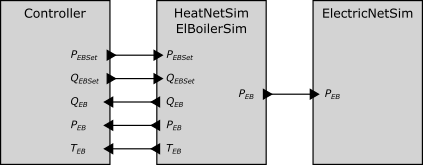

## Test Specification Definition

<table>
<tr>
<th colspan=1>
ID</th>
<td colspan=1>

TC12.TS01
</td>
</tr>
<tr>
<th colspan=1>
Reference to Test Case</th>
<td colspan=1>

TC12
</td>
</tr>
<tr>
<th colspan=1>
Title of Test</th>
<td colspan=1>

Electric Boiler Activation for Excess Power Consumption with Proportional Controllers
</td>
</tr>
<tr>
<th colspan=1>
Test Rationale</th>
<td colspan=1>

This test aims at self-consumption of excess power generated from distributed renewable power generators (i.e., the rooftop PV generators). The excess power is fed into the local heating network. The local use of excess power helps mitigate problems in the electric distribution network, such as reversed power flows, high loading of equipment and voltage band violations. On the other side, distributed infeed into the local heating network might cause problems due to reversed mass flows, fluctuating supply temperatures or differential pressure problems.

Electric boilers are used as power-to-heat appliances. They consist of an electric heater, for the conversion of power to heat, and a thermal energy storage, for the (short-term) storage of generated heat.

The operation of the electric boilers and storage units are governed by simple proportional controllers.
</td>
</tr>
<tr>
<th colspan=1>
Specific Test System  
(graphical)</th>
<td colspan=1>

This test case uses simple proportional controllers with fixed operational parameters (e.g., temperature thresholds) to calculate new setpoints for the electric boilers. The district heating network/electric boiler simulation send actual power consumption of electric boilers to the electric network simulation.

A detailed description of the controller scheme is given in: 

</td>
</tr>
<tr>
<th colspan=1>
Target measures</th>
<td colspan=1>

The test is successfully passed if power flows to the external network are reduced compared to a scenario without power-to-heat. Simultaneously, power import into the network is not allowed to increase by more than 1%. Moreover, relevant network constraints need to be met.
</td>
</tr>
<tr>
<th colspan=1>
Input and output parameters</th>
<td colspan=1>
<ul>
<li>PEBSet … electric boiler setpoint for nominal heat flow</li>
<li>QEBSet … electric boiler setpoint for nominal power consumption</li>
<li>QEB … electric boiler heat flow</li>
<li>PEB … electric boiler power consumption</li>
<li>TEB … thermal storage temperature</li>
</ul></td>
</tr>
<tr>
<th colspan=1>
Test Design</th>
<td colspan=1>

This test needs to run for an entire year to account for the daily/seasonal variations of loads/generators and the impact of the predictive control, as it usually plans ahead several hours/days.
</td>
</tr>
<tr>
<th colspan=1>
Initial system state</th>
<td colspan=1>
<ul>
<li>district heating pipes have nominal temperatures</li>
<li>thermal storages are empty, i.e., have nominal return temperature of district heating network</li>
<li>electric boilers not running</li>
</ul></td>
</tr>
<tr>
<th colspan=1>
Evolution of system state and test signals</th>
<td colspan=1>
<ul>
<li>Every 15 minutes the electric boiler controllers receive current heat generation and heat discharge from respective electric boilers, based on which new setpoints are calculated. </li>
<li>Every 15 minutes the electric network receives current power consumption from electric boilers</li>
<li>Except for the previous, subsystems are independent from each other.</li>
</ul></td>
</tr>
<tr>
<th colspan=1>
Other parameters</th>
<td colspan=1>

None
</td>
</tr>
<tr>
<th colspan=1>
Temporal resolution</th>
<td colspan=1>

Local heating and electric boilers:
<ul>
<li>dynamic, variable step size (typically order of seconds)</li>
</ul>
Electric network and predictive controllers:
<ul>
<li>15 minutes</li>
</ul></td>
</tr>
<tr>
<th colspan=1>
Source of uncertainty</th>
<td colspan=1>

None
</td>
</tr>
<tr>
<th colspan=1>
Suspension criteria / Stopping criteria</th>
<td colspan=1>
<ul>
<li>critical violation of network operation constraints (freezing/boiling water in any part of district heating network, etc.)</li>
<li>predictive controller unable to predict next step (infeasible model)</li>
</ul></td>
</tr>
</table>

