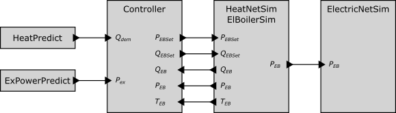

## Test Specification Definition

<table>
<tr>
<th colspan=1>
ID</th>
<td colspan=1>

TC12.TS02
</td>
</tr>
<tr>
<th colspan=1>
Reference to Test Case</th>
<td colspan=1>

TC12
</td>
</tr>
<tr>
<th colspan=1>
Title of Test</th>
<td colspan=1>

Electric Boiler Activation for Excess Power Consumption with Model-predictive Control
</td>
</tr>
<tr>
<th colspan=1>
Test Rationale</th>
<td colspan=1>

This test is conceptionally similar to TC12.TS01. The difference is that for planning the operation of the storage units and the electric heaters a predictive controller is used. The aim of the controller is to minimize negative residual load of the electric network. To enable this planning, negative residual load in the electric as well as heat demand in the heat network need to be known/predicted. This test assumes perfect knowledge of these time-series data and, thus, does not focus on the quality of predictions.
</td>
</tr>
<tr>
<th colspan=1>
Specific Test System  
(graphical)</th>
<td colspan=1>

The controller uses heat demand and excess power predictions together with current storage temperatures, electric boiler power consumption and heat discharge to calculate new setpoints for the electric boilers. The district heating network/electric boiler simulation send actual power consumption of electric boilers to electric network simulation.

This test case uses an advanced model-predictive control scheme for activating the electric boilers and storage units. A detailed description of the controller scheme is given in:

</td>
</tr>
<tr>
<th colspan=1>
Target measures</th>
<td colspan=1>

same as TC12.TS01
</td>
</tr>
<tr>
<th colspan=1>
Input and output parameters</th>
<td colspan=1>
<ul>
<li>Qdem … predicted heat demand</li>
<li>Pex … predicted power demand</li>
<li>otherwise same as TC12.TS01</li>
</ul></td>
</tr>
<tr>
<th colspan=1>
Test Design</th>
<td colspan=1>

The electric boilers are activated with the help of a predictive control approach, which enables a planning of discharging and charging the thermal storage units with regards to excess power availability. For instance, thermal storages can be emptied before times with high excess power but low heat demand and thus makes the use of the electric heater still possible.

This test needs to run for an entire year to cover the daily/seasonal variations of loads/generators and the impact of the predictive control, as it usually has planning horizons of multiple hours/days.
</td>
</tr>
<tr>
<th colspan=1>
Initial system state</th>
<td colspan=1>

same as TC12.TS01
</td>
</tr>
<tr>
<th colspan=1>
Evolution of system state and test signals</th>
<td colspan=1>
<ul>
<li>Every 15 minutes the electric boiler controllers receive current heat generation and heat discharge from respective electric boilers together with predicted residual load of electric network and heat demand of district heating network. Thus, electric boilers receive new setpoints for heat generation &amp; heat discharge from model predictive controllers.</li>
<li>Every 15 minutes electric network receives current power consumption from electric boilers</li>
<li>Otherwise subsystems are independent from each other.</li>
</ul></td>
</tr>
<tr>
<th colspan=1>
Other parameters</th>
<td colspan=1>

None
</td>
</tr>
<tr>
<th colspan=1>
Temporal resolution</th>
<td colspan=1>

same as TC12.TS01
</td>
</tr>
<tr>
<th colspan=1>
Source of uncertainty</th>
<td colspan=1>

None
</td>
</tr>
<tr>
<th colspan=1>
Suspension criteria / Stopping criteria</th>
<td colspan=1>

same as TC12.TS01
</td>
</tr>
</table>

