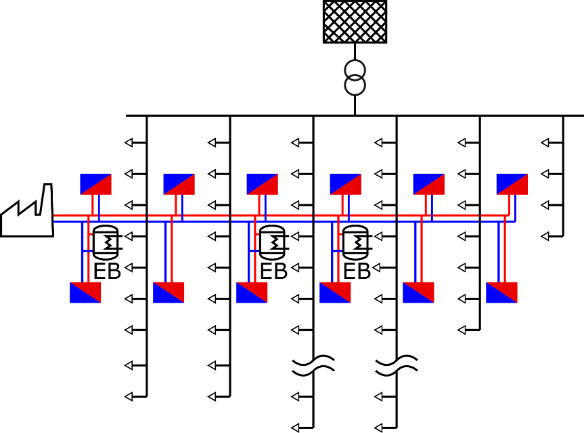

## Identification

<table>
<tr>
<th colspan=1>
ID</th>
<td colspan=1>

TC12
</td>
</tr>
<tr>
<th colspan=1>
Author</th>
<td colspan=1>

Benedikt Leitner, Edmund Widl
</td>
</tr>
<tr>
<th colspan=1>
Version</th>
<td colspan=1>

2
</td>
</tr>
<tr>
<th colspan=1>
Project</th>
<td colspan=1>

SmILES, ERIGrid 2.0
</td>
</tr>
<tr>
<th colspan=1>
Date</th>
<td colspan=1>

2020-12-17
</td>
</tr>
</table>

## Test Case Definition

<table>
<tr>
<th colspan=2>
Name of the Test Case</th>
<td colspan=1>

Verification of improved self-consumption of RES in a coupled heat &amp; power network using power-to-heat
</td>
</tr>
<tr>
<th colspan=2>
Narrative</th>
<td colspan=1>

This test case is used to verify that the self-consumption of renewable energy sources in a coupled heat and power network improves when using distributed power-to-heat appliances compared to a base scenario without power-to-heat. Different control schemes can be applied to reach this goal, which can be assessed in the context of this test case.
</td>
</tr>
<tr>
<th colspan=2>
Function(s) under Investigation (FuI)</th>
<td colspan=1>

Control function(s) of power-to-heat appliances

Note: The actual control schemes (and the corresponding control functions) are defined in the test specifications.
</td>
</tr>
<tr>
<th colspan=2>
Object under Investigation (OuI)</th>
<td colspan=1>

External electric grid:
<ul>
<li>power flows (to and from)</li>
</ul>
Gas heating boiler (for base load):
<ul>
<li>heat generation</li>
</ul>
Local heating network:
<ul>
<li>supply temperatures at thermal substations</li>
<li>differential pressures at thermal substations</li>
</ul>
Low voltage distribution network:
<ul>
<li>voltages at consumer connection points</li>
</ul></td>
</tr>
<tr>
<th colspan=2>
Domain under Investigation (DuI)</th>
<td colspan=1>
<ul>
<li>electric (low voltage distribution network)</li>
<li>heat (local heating network)</li>
</ul></td>
</tr>
<tr>
<th colspan=2>
Purpose of Investigation (PoI)</th>
<td colspan=1>

Verification of reduction of energy flows flowing out of the network. At the same time energy imports should not increase and the operational parameters of both networks must remain within acceptable ranges.
</td>
</tr>
<tr>
<th colspan=3>
</th>
</tr>
<tr>
<th colspan=2>
System under Test (SuT)</th>
<td colspan=1>

The SuT comprises a coupled low-voltage distribution network and local heating network (sub-urban district), which host residential homes, offices and workshops. A high share of the building stock is connected to the heating network, which is supplied by a central gas-fired boiler. Generation from rooftop photovoltaic power plants covers a significant part of the annual electric energy demand. Electric boilers are installed in the heating network with the aim to further increase the self-consumption of photovoltaic generation at a network scale.

</td>
</tr>
<tr>
<th colspan=2>
Functions under Test (FuT)</th>
<td colspan=1>
<ul>
<li>energy flows (in and out of the networks)</li>
<li>effort variables of both networks (bus voltages, supply temperatures, differential pressures)</li>
<li>loading of the transformer</li>
</ul></td>
</tr>
<tr>
<th colspan=3>
</th>
</tr>
<tr>
<th colspan=2>
Test criteria (TCR)</th>
<td colspan=1>
</td>
</tr>
<tr>
<td colspan=1>
</td>
<th colspan=1>
Target Metrics (TM)</th>
<td colspan=1>
<ul>
<li>total power flow from external electric grid in MWh</li>
<li>total heat flow from base district heating boiler in MWh</li>
<li>voltages at consumer connection points in p.u. </li>
<li>transformer loading in %</li>
<li>differential pressures at substations in bar</li>
<li>supply temperatures at substations in °C</li>
</ul></td>
</tr>
<tr>
<td colspan=1>
</td>
<th colspan=1>
Variability Attributes (VA)</th>
<td colspan=1>

Controllable factors:
<ul>
<li>electric boiler activation</li>
<li>gas boiler activation</li>
</ul>
Uncontrollable factors:
<ul>
<li>demand (electrical and thermal)</li>
<li>PV generation</li>
</ul></td>
</tr>
<tr>
<td colspan=1>
</td>
<th colspan=1>
Quality Attributes (QA)</th>
<td colspan=1>

The power flow to the external grid and the heat flow from the base district heating boiler are reduced compared to a scenario without power-to-heat appliances. Thus, self-consumption of RES is improved. At the same time, the power flow from the external grid is not allowed to increase more than 1%.

Moreover, the following technical criteria must be met:
<ul>
<li>voltages at consumer connection points within 0.95 p.u. and 1.05 p.u. for 99% of time</li>
<li>differential pressures at substations within 0.9 bar and 5 bar for 99% of time</li>
<li>supply temperatures at substations above 65°C for 99% of time</li>
<li>transformer loading never goes above 100%</li>
</ul></td>
</tr>
</table>

## Qualification Strategy

