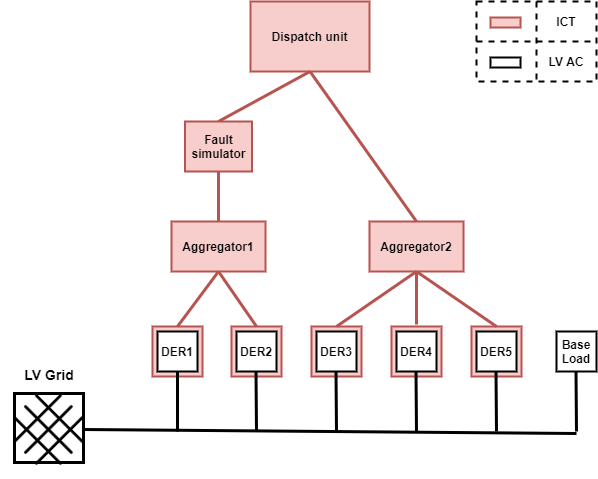

## Test Specification Definition

<table>
<tr>
<th colspan=1>
ID</th>
<td colspan=1>

TC17.TS2
</td>
</tr>
<tr>
<th colspan=1>
Reference to Test Case</th>
<td colspan=1>

TC17
</td>
</tr>
<tr>
<th colspan=1>
Title of Test</th>
<td colspan=1>

Characterization of recovery from failure
</td>
</tr>
<tr>
<th colspan=1>
Test Rationale</th>
<td colspan=1>

This test will characterize the response of the fault recovery mechanism. The results obtained will also allow a performance comparison with the baseline system.
</td>
</tr>
<tr>
<th colspan=1>
Specific Test System  
(graphical)</th>
<td colspan=1>

</td>
</tr>
<tr>
<th colspan=1>
Target measures</th>
<td colspan=1>
<ul>
<li>Time to restoration of service delivery</li>
<li>Deviation of service delivered from service requested</li>
</ul></td>
</tr>
<tr>
<th colspan=1>
Input and output parameters</th>
<td colspan=1>
<ul>
<li>Input: Level of base load [kW]</li>
<li>Input: Service requested (by DSO) to dispatch unit</li>
<li>Input: Time of fault occurrence [s]</li>
<li>Output: Active power production/consumption at individual DERs [kW]</li>
<li>Output: Active power sum flow at grid connection [kW]</li>
</ul></td>
</tr>
<tr>
<th colspan=1>
Test Design</th>
<td colspan=1>

The test can be performed as a hardware experiment, a simulation experiment or a combination of the two.
<ul>
<li>Configure grid, DER units and base load to bring system into initial state (t=t0)</li>
<li>At t=t1, request a load relief service from the dispatch unit, wait for aggregators to activate DER units. Measure the effectiveness of the service delivery (impact on grid) after stabilization.</li>
<li>At t=t2, command fault simulator to disrupt communication to aggregator 1</li>
<li>Determine the points in time t=t3 where the dispatch unit has noticed the fault, and t=t4 where aggregator 2 has rescheduled.</li>
<li>Continuously measure the effectiveness of the service delivery in order to determine the disruption to service delivery during t3&lt;t&lt;t4.</li>
<li>Verify that the effectiveness of service delivery after t4 is comparable to before the fault (t&lt;t2).</li>
</ul></td>
</tr>
<tr>
<th colspan=1>
Initial system state</th>
<td colspan=1>
<ul>
<li>No service requested by dispatch unit</li>
<li>All DERs in neutral state (not delivering a service)</li>
<li>Feeder in overload condition by combined baseload+DER consumption</li>
<li>Fault simulator in bypass state (no fault)</li>
</ul></td>
</tr>
<tr>
<th colspan=1>
Evolution of system state and test signals</th>
<td colspan=1>
<ul>
<li>Base load continues to change, following e.g. a random pattern</li>
<li>Aggregator response tracks changes in base load</li>
<li>Dispatch unit moves from “service delivery” to “fault recovery” and back to “service delivery”</li>
</ul></td>
</tr>
<tr>
<th colspan=1>
Other parameters</th>
<td colspan=1>
</td>
</tr>
<tr>
<th colspan=1>
Temporal resolution</th>
<td colspan=1>

Electrical system measurements: 1s. Logging of ICT events (messages exchanged, communication fault event etc.) using timestamps with at least 1ms resolution.
</td>
</tr>
<tr>
<th colspan=1>
Source of uncertainty</th>
<td colspan=1>

Residual time synchronization difference between ICT entities
</td>
</tr>
<tr>
<th colspan=1>
Suspension criteria / Stopping criteria</th>
<td colspan=1>

Elapsed time (fixed length experiment)
</td>
</tr>
</table>

