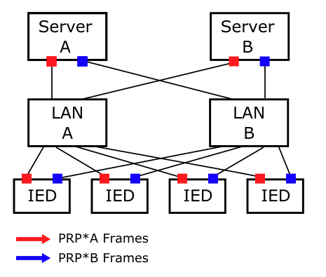
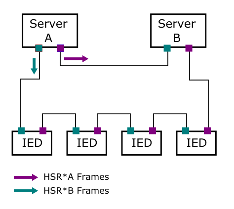

## Test Specification Definition

<table>
<tr>
<th colspan=1>
ID</th>
<td colspan=1>

TC23.1
</td>
</tr>
<tr>
<th colspan=1>
Reference to Test Case</th>
<td colspan=1>

TC23
</td>
</tr>
<tr>
<th colspan=1>
Title of Test</th>
<td colspan=1>

Verification of the reliability of Substation Automation Systems (SASs) with redundancy in the communication network
</td>
</tr>
<tr>
<th colspan=1>
Test Rationale</th>
<td colspan=1>

With the use of IEC 61850 standard, substations are nowadays becoming digitized and automated with digital relays/IEDs and a LAN based communication network for connecting these IEDs. 

Failure of the communication, even for the few milliseconds, may jeopardize critical functions such as protection and lead to catastrophic effects within or beyond the substation impacting the operation of grid. New redundant architectures, notably parallel redundancy protocol (PRP) and high High-Availability Seamless Redundancy (HSR) from IEC 62439-3, have been used to increase the reliability of IEC 61850 LAN based substation automation communication networks [1].

PRP provides high reliability through two independent LAN networks. The PRP enabled nodes are connected to these two isolated networks, which operate in parallel as shown below in Fig. 1 below. Frames are duplicated in the source and are sent over both networks; the destination PRP enabled node receives packets from the first network and accepts it, if it is correct, and then the copy from the second network will be discarded as duplicate. HSR operation is similar to PRP but HSR uses a single LAN with a ring topology and it uses two independent paths (clockwise and counterclockwise). Both architectures aim to provide an ideal “zero recovery time” with no packet loss. This test aims to investigate the reliability of these two recent redundant communication networks in substation automation.

[1] International Electrotechnical Commission 

[2] S. Kumar, N. Das and S. Islam, "High performance communication redundancy in a digital substation based on IEC 62439-3 with a station bus configuration," 2015 Australasian Universities Power Engineering Conference (AUPEC), 2015, pp. 1-5, doi: 10.1109/AUPEC.2015.7324838.
</td>
</tr>
<tr>
<th colspan=1>
Specific Test System  
(graphical)</th>
<td colspan=1>

The specific test system consists of a real-time grid simulator, protection IEDS, Ethernet switches (x2), communication cables (x2). The real-time simulator is used to model the power system dynamics as well as some IED functions such as Merging unit (generating sampled values), circuit breaker functionality. The physical IEDs (for protection) will be connected to the real-time simulator through the two redundant communication networks in a C-HIL setup.

Fig. 1: PRP Network Topology

Fig. 2: HSR Network Topology
</td>
</tr>
<tr>
<th colspan=1>
Target measures</th>
<td colspan=1>
<ul>
<li>End to end delay and packet loss of IEC 61850 GOOSE and sampled value (SV) messages after the introduction of fault. </li>
<li>Availability and Mission reliability (ability to continually deliver service) of the communication network after the introduction fault.</li>
</ul></td>
</tr>
<tr>
<th colspan=1>
Input and output parameters</th>
<td colspan=1>

Input parameters:
<ul>
<li>Failure type</li>
<li>Failure rate of components</li>
<li>Repair rate of components</li>
<li>Communication network topology</li>
<li>Background traffic rate</li>
<li>Degree of redundancy</li>
</ul>
Output parameters:
<ul>
<li>Maximum packet delay</li>
<li>Packet loss</li>
<li>Time duration of service interruption</li>
</ul></td>
</tr>
<tr>
<th colspan=1>
Test Design</th>
<td colspan=1>

The test design is as follows.
<ol>
<li>System starts with normal operating conditions, no fault and there will be a normal GOOSE and SV stream (every 10 ms and 0.25 ms respectively)</li>
<li>Add some background traffic to the ethernet switches accounting for traffic from other IEDs or other devices in the substation.</li>
<li>Introduce faults in the system. This could be:</li>
<li>Failure in the communication network</li>
<li>OR, simultaneous failure in the communication network and the power system</li>
<li>During a failure in the communication network, the fail-over algorithm is activated and the system switches to the backup network with the redundant switches and network links. </li>
<li>If there is also a failure in the power system right before or after the failure of the communication system failure, it will also change the GOOSE traffic behavior (burst of GOOSE messages will be transmitted).</li>
<li>Collect the target measurements/metrics</li>
<li>end to end delay of GOOSE and SV streams between the IEDs and the virtual devices (MUs) in the Opal RT.</li>
<li>Down time of the communication between the IEDs and virtual MUs (if any)</li>
<li>Repeat these steps by varying the failure scenarios, background traffic, redundancy type and degree.</li>
</ol></td>
</tr>
<tr>
<th colspan=1>
Initial system state</th>
<td colspan=1>

Normal system state where there is no failure in the power and communication system. There will be a normal GOOSE (status update) between IEDs (also between IED and breakers), and SV streams from OPAL virtual MUs to the physical IEDs.
</td>
</tr>
<tr>
<th colspan=1>
Evolution of system state and test signals</th>
<td colspan=1>
<ol>
<li>Initial state where there is no failure in the system 
(Normal GOOSE and SV streams)</li>
<li>Failure of network components and/or the power system occur.</li>
<li>The GOOSE and SV traffic pattern will change (for power system failures). The IEDs will send burst of GOOSE messages for a certain duration to make sure that faults are cleared on time. </li>
<li>When the IEDs or the PRP enabled ethernet switches detect a failure on the primary communication path (network), a fail-over function will be activated (in response to failure in the communication system)</li>
<li>The IEDs start to accept GOOSE and SV packets coming through the secondary path (network).</li>
<li>GOOSE data rate will return to the normal rate.</li>
<li>After a recovery of failed nodes (the communication network), IEDs and PRP enabled ethernet switches will revert back to accepting packets from the primary communication network.</li>
</ol></td>
</tr>
<tr>
<th colspan=1>
Other parameters</th>
<td colspan=1>
<ul>
<li>Temporal order of contingency events<ul>
<li>ICT failure causes PS fault</li>
<li>PS fault causes ICT failure</li>
<li>PS fault and ICT failure coincident</li>
</ul>
</li>
</ul></td>
</tr>
<tr>
<th colspan=1>
Temporal resolution</th>
<td colspan=1>

100 us
</td>
</tr>
<tr>
<th colspan=1>
Source of uncertainty</th>
<td colspan=1>

Background traffic data rate, configuration of the communication network (ethernet switches), Network devices or IED's capability to support the PRP/HSR architectures.
</td>
</tr>
<tr>
<th colspan=1>
Suspension criteria / Stopping criteria</th>
<td colspan=1>

Exceeding of quality attributes:
<ul>
<li>Communication is down for 200 milliseconds (protection related applications) or 3 second for SCADA- IED communication.</li>
</ul></td>
</tr>
</table>

