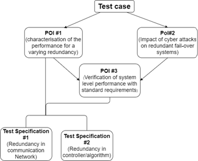

## Identification

<table>
<tr>
<th colspan=1>
ID</th>
<td colspan=1>

23
</td>
</tr>
<tr>
<th colspan=1>
Author</th>
<td colspan=1>

Tesfaye Amare Zerihun
</td>
</tr>
<tr>
<th colspan=1>
Version</th>
<td colspan=1>

1
</td>
</tr>
<tr>
<th colspan=1>
Project</th>
<td colspan=1>

ERIGrid 2.0
</td>
</tr>
<tr>
<th colspan=1>
Date</th>
<td colspan=1>

10/05/2020
</td>
</tr>
</table>

## Test Case Definition

<table>
<tr>
<th colspan=2>
Name of the Test Case</th>
<td colspan=1>

Verification of the reliability of a redundant system or algorithm (e.g. failover)
</td>
</tr>
<tr>
<th colspan=2>
Narrative</th>
<td colspan=1>

The aim of this test case is to assess and verify the reliability of failover systems in smart grids that relies on putting redundancy. Redundancy is mainly used for critical smart grid applications such as protection in substations. In general, the redundancy can be either for control systems (such as the SCADA controller), communication networks or network controller (such as SDN controller), or a redundancy in the sensors and actuators (CT/PTs, Merging units, Breakers). Specifically, this test case looks into the reliability of failover systems with a redundancy in the communication networks.

The ICT support system/communication network may fail due various reasons for e.g., component (hardware) failures, environmental failures (such as weather disruption failing multiple components), a power outage, overloading of the network (capacity shortage) or cyber-attack. A fail-over system tries to quickly detect failures and switch to backup systems (smooth transition in the case of active standby systems) or it tries to recover the system after experiencing some performance glitch (the case of passive standby system). Unlike active backup systems, in the case of passive redundant systems, there can be small system down time until the backup system is powered on and takeover.  The test case investigates the reliability of active or passive fail over systems to verify if these systems can meet the requirements (delays, packet loss or system down time) specified by the smart grid application considered or requirements set by the standards and protocols such as IEC 61850.
</td>
</tr>
<tr>
<th colspan=2>
Function(s) under Investigation (FuI)</th>
<td colspan=1>
<ul>
<li>Exchange of data (measurement and control commands) through the communication network</li>
<li>Control functions on the local controllers / IEDs</li>
<li>Protection functions on the local controllers / IEDs</li>
</ul></td>
</tr>
<tr>
<th colspan=2>
Object under Investigation (OuI)</th>
<td colspan=1>

Communication Network (network devices, switches, network links), control devices or IEDs
</td>
</tr>
<tr>
<th colspan=2>
Domain under Investigation (DuI)</th>
<td colspan=1>
<ul>
<li>Information &amp; Communication System</li>
<li>Control system</li>
<li>Power system</li>
</ul></td>
</tr>
<tr>
<th colspan=2>
Purpose of Investigation (PoI)</th>
<td colspan=1>
<ul>
<li>PoI#1: Characterization of the performance of fail-over systems with a varying degree of redundancy. <ul>
<li>PoI#1.1: Characterization of the performance of fail-over systems with redundancy in the communication network.</li>
<li>PoI#1.2: Characterization of the performance of fail-over systems with redundancy in the controller/IED</li>
</ul>
</li>
</ul><ul>
<li>PoI#2: Characterization of the redundant communication/control system for its vulnerability towards cyber attacks</li>
<li>PoI#3: Verification of the system level performance with standard requirements (if it complies with the minimum expected KPIs e.g., down time, packet loss or delay)</li>
</ul></td>
</tr>
<tr>
<th colspan=3>
</th>
</tr>
<tr>
<th colspan=2>
System under Test (SuT)</th>
<td colspan=1>
<ul>
<li>Communication network (Switches, routers, network links) </li>
<li>Sensors (voltage sensors, CT/PT basic control), Actuators (breakers, intelligent switches)</li>
<li>SCADA Controller (for e.g., FLISR, voltage control, monitoring functions) or local controllers/IEDs</li>
<li>Power transmission system (substations, transmission lines)</li>
</ul></td>
</tr>
<tr>
<th colspan=2>
Functions under Test (FuT)</th>
<td colspan=1>
<ul>
<li>Capability of the communication network/ devices to facilitate data exchange between controllers/IEDs, sensors and actuators (breaker, disconnectors)</li>
<li>Control and Protection functions</li>
<li>Monitoring capability of sensors (devices such as Merging units, PMUs)</li>
<li>Actuator (breaker, disconnector) functions</li>
</ul></td>
</tr>
<tr>
<th colspan=3>
</th>
</tr>
<tr>
<th colspan=2>
Test criteria (TCR)</th>
<td colspan=1>
<ul>
<li>Run the system without introducing faults, and measure the communication network's performance during the normal operating condition… </li>
<li>Introduce a fault and measure the communication network performance degradation right after a failure/fault occur/injected.</li>
<li>Calculate and obtain the overall system performance (availability, reliability).</li>
</ul></td>
</tr>
<tr>
<td colspan=1>
</td>
<th colspan=1>
Target Metrics (TM)</th>
<td colspan=1>
<ol>
<li>End to end delay, packet loss<ul>
<li>During a normal operating condition </li>
<li>After introducing a fault</li>
</ul>
</li>
<li>Up time, down time, availability and reliability <ul>
<li>After introducing a fault</li>
</ul>
</li>
</ol></td>
</tr>
<tr>
<td colspan=1>
</td>
<th colspan=1>
Variability Attributes (VA)</th>
<td colspan=1>
<ul>
<li>Redundancy type and degree (active-active, active-standby, active-inactive)</li>
<li>Number of simultaneous (component) failures </li>
<li>Communication network traffic situation
(background traffic)</li>
<li>Communication topology</li>
<li>Failure type <ul>
<li>Cascading (from PS to CS)</li>
<li>Hardware</li>
<li>Software</li>
</ul>
</li>
</ul></td>
</tr>
<tr>
<td colspan=1>
</td>
<th colspan=1>
Quality Attributes (QA)</th>
<td colspan=1>

Pass: End to end delay (average, maximum) and packet loss are within the maximum limit or threshold values set by specifications on standard communication protocol or the smart grid application (such as protection) considered. OR, the availability, reliability measures are within the limit on the specification requirement set by system administrator.
<ul>
<li>Packet loss &gt; T, where T is a threshold value set according to the application (protection) type considered.  </li>
<li>Packet delay larger than D ms, where D is the delay tolerance which depend on the application (protection) type considered. The delay tolerance varies from 1 ms (for bus bar protection), 4 to 8 ms (for other type of protection schemes) up to 800 ms for IED to SCADA communication.</li>
</ul>
Fail: If the measured metrics (delay, packet loss, availability, or reliability) exceeds the threshold values.
</td>
</tr>
</table>

## Qualification Strategy

